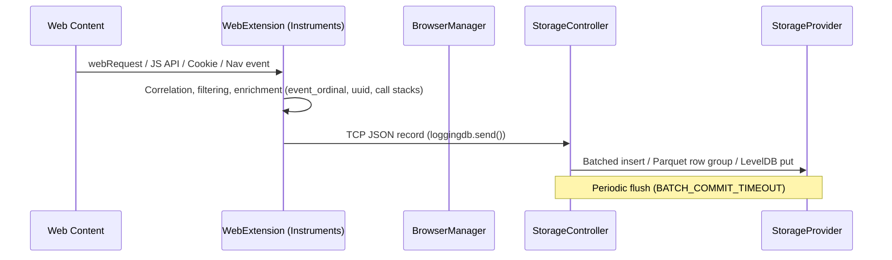
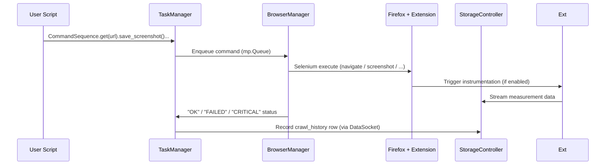

# OpenWPM Architecture

**Document Version:** 1.0  
**OpenWPM Version:** 0.34.0  
**Last Updated:** 2026-05-27T02:47:30Z  
**Workspace:** OpenWPM-1776  
**Status:** Canonical Reference

---

## 1. Purpose and Scope

OpenWPM is a research-grade web privacy measurement platform designed for large-scale studies (thousands to millions of websites). It provides high-fidelity, automated collection of:

- HTTP(S) requests, responses, redirects, and bodies
- JavaScript API accesses and call stacks (configurable)
- Cookie creation/modification (HTTP and JS)
- Navigation and tab/frame lifecycle events
- DNS resolutions
- Browser profile state and rendered artifacts (screenshots, source)

The platform is built on **Firefox** (via unbranded/custom builds) + **Selenium** + a **privileged WebExtension** that leverages experimental Firefox APIs unavailable to standard extensions.

This document describes the system architecture, process model, data flows, and component responsibilities. It is the primary architecture reference. See also:

- [Platform-Architecture.md](Platform-Architecture.md) (historical high-level)
- [Architecture-Internals.md](Architecture-Internals.md) (detailed coupling and timeout analysis)
- [Configuration.md](Configuration.md)

---

## 2. High-Level Architecture

```mermaid
flowchart TB
    subgraph User["Researcher / Operator"]
        Demo[demo.py / Custom Script]
    end

    subgraph Main["Main Process (TaskManager)"]
        TM[TaskManager<br/>orchestrator + watchdogs]
        MPLogger[MPLogger<br/>centralized logging]
        Watchdog[Watchdog Threads<br/>memory + process]
    end

    subgraph Storage["StorageController Process"]
        SC[StorageController<br/>asyncio TCP server]
        SSP[StructuredStorageProvider<br/>SQLite / Parquet / S3 / GCS]
        USP[UnstructuredStorageProvider<br/>LevelDB / Gzip / S3 / GCS]
    end

    subgraph Browsers["N × BrowserManager Processes"]
        BM1[BrowserManager 1]
        BMN[BrowserManager N]
        subgraph Firefox1["Firefox Instance 1"]
            WD1[Selenium WebDriver]
            XPI1[OpenWPM WebExtension<br/>privileged]
        end
        subgraph FirefoxN["Firefox Instance N"]
            WDN[Selenium WebDriver]
            XPIN[OpenWPM WebExtension<br/>privileged]
        end
    end

    Demo --> TM
    TM -->|mp.Queue (commands)| BM1 & BMN
    BM1 & BMN -->|mp.Queue (status)| TM
    XPI1 & XPIN -->|TCP JSON (instrumentation data)| SC
    TM -->|DataSocket TCP + dill| SC
    SC --> SSP & USP
    Watchdog -.->|kill/restart| BM1 & BMN
    MPLogger -. log aggregation .-> TM
```

**Key Isolation Properties:**
- Browser instances are fully isolated in separate OS processes.
- Storage is isolated in its own process (reduces data loss on browser crashes).
- No direct data path from browsers back to the TaskManager (only status codes and limited metadata).

---

## 3. Core Components

### 3.1 TaskManager (`openwpm/task_manager.py`)

The primary user-facing orchestrator.

**Responsibilities:**
- Configuration validation (`validate_crawl_configs`)
- Spawning and lifecycle management of StorageController, BrowserManagers, and MPLogger
- Command sequencing via `CommandSequence`
- Watchdog threads (`memory_watchdog`, `process_watchdog`)
- Failure counting and recovery (up to `failure_limit`)
- Recording crawl history metadata
- Graceful shutdown and resource cleanup

**Command Execution Model:**
Commands are submitted as `CommandSequence` objects (non-blocking by default). The TaskManager dispatches them to available BrowserManager instances.

### 3.2 BrowserManager (`openwpm/browser_manager.py`)

Wraps a single Firefox instance driven by Selenium.

**Lifecycle:**
1. Profile creation / restoration (from `seed_tar` or fresh)
2. Firefox launch via `deploy_browsers/`
3. Extension installation and port discovery (via `extension_port.txt`)
4. Command dispatch loop (`execute()` on each `BaseCommand`)
5. Status reporting back to TaskManager

**Important:** All heavy data processing and instrumentation interpretation happens inside the BrowserManager or Extension. Results are streamed directly to StorageController.

### 3.3 WebExtension (`Extension/src/`)

The data collection engine. Implemented in TypeScript, bundled as a privileged (`experiment_apis`) WebExtension.

**Instruments (background scripts):**
- `http-instrument.ts` — Full request/response/redirect lifecycle, POST parsing, content hashing option
- `javascript-instrument.ts` — JS property access, function calls, getters/setters (with configurable recursion, allow/deny lists, call stack capture)
- `cookie-instrument.ts` — All cookie changes (creation, update, deletion) with causes
- `navigation-instrument.ts` — `webNavigation` events with rich transition and frame metadata
- `dns-instrument.ts` — DNS resolution events
- `callstack-instrument.ts` — (Currently non-functional per known issue #557)

**Privileged APIs Used:**
- `webRequest` (blocking)
- `webNavigation`
- `cookies`
- `dns`
- Custom `experiment_apis`: `sockets`, `profileDirIO`, `stackDump`

The extension requires a specially built Firefox (unbranded or with `extensions.experiments.enabled` + security disabled) because it uses Mozilla-internal privileged extension APIs.

### 3.4 StorageController (`openwpm/storage/storage_controller.py`)

Dedicated process that receives data over two channels:

1. **Extension data** — TCP socket, JSON serialized (from `loggingdb.ts`)
2. **Platform data** — `DataSocket` (TCP + `dill` serialization) for crawl history, task metadata, etc.

**Pluggable Providers:**
- **Structured:** SQLiteStorageProvider, LocalArrowProvider (Parquet), S3/GCS Parquet
- **Unstructured:** LevelDBProvider, LocalGzipProvider, S3/GCS

**Design Goal:** Survive browser crashes without losing buffered measurements.

### 3.5 Commands (`openwpm/commands/`)

All commands inherit from `BaseCommand` and implement `execute()`.

Core commands include (see `browser_commands.py`):
- `GetCommand` (navigation)
- `ScreenshotCommand`
- `DumpPageSourceCommand`
- `ProfileCommands` (save/restore)
- `FinalizeCommand` (visit cleanup)
- Custom commands via `custom_command.py` pattern (must be defined in separate module)

---

## 4. Data Flow Diagrams

### 4.1 Instrumentation Data Path



### 4.2 Command Execution Lifecycle



---

## 5. Storage Schema and Data Model

The structured schema (SQLite + Parquet) is defined in two synchronized files that **must** be kept in sync:

- `openwpm/storage/schema.sql`
- `openwpm/storage/parquet_schema.py`

**Core Tables (selected):**
- `task`, `crawl` — experiment metadata and configuration snapshots (JSON)
- `site_visits` — one row per `get()` / navigation
- `crawl_history` — every command executed + status + duration + error
- `http_requests`, `http_responses`, `http_redirects`
- `javascript` — symbol accesses, calls, values, stacks
- `javascript_cookies`
- `navigations`
- `callstacks`
- `dns_responses`
- `incomplete_visits`

**Unstructured data** (screenshots, page sources, profile archives, saved content) is stored via the unstructured provider or `manager_params.data_directory`.

**Reproducibility Note:** The full `manager_params` and `browser_params` (including JS instrument settings) are serialized into the `task` and `crawl` tables.

---

## 6. Configuration System

Defined in `openwpm/config.py` using dataclasses + `dataclasses_json`.

- `ManagerParams` — platform-wide (num_browsers, data_directory, watchdogs, failure_limit)
- `BrowserParams` — per-browser (instruments on/off, JS settings, display_mode, prefs, profile seeds, bot_mitigation, etc.)

Validation functions:
- `validate_browser_params`
- `validate_manager_params`
- `validate_crawl_configs`

JS instrumentation settings are further cleaned and validated via `js_instrumentation.py` and `clean_js_instrumentation_settings`.

---

## 7. Fault Tolerance and Recovery

- BrowserManager crashes → TaskManager detects via status queue or watchdog → restarts browser (new profile or seed)
- StorageController isolation → measurement data survives browser death
- `FinalizeCommand` + visit_id lifecycle management
- `incomplete_visits` table for post-crawl analysis of partial visits

---

## 8. Security and Privacy Architecture Considerations

See the dedicated **[Security-and-Privacy.md](Security-and-Privacy.md)** document for:

- Privileged extension attack surface and mitigations
- Data sensitivity classification
- Supply-chain controls (pinned dependencies via `repin.sh`)
- Docker hardening notes
- Threat model for measurement platforms
- Responsible disclosure process

**Critical Points (summary):**
- The WebExtension runs with near-complete browser privileges and `unsafe-eval` in CSP. It can only be loaded in specially configured Firefox builds.
- All serialization between processes uses `dill`/`pickle` over localhost TCP or `mp.Queue` (trusted boundary).
- No user data or study PII should ever be committed to this repository.

---

## 9. Extensibility Points

1. **Custom Commands** — Implement `BaseCommand`, register via importable module (see `custom_command.py`).
2. **New Storage Providers** — Implement `StructuredStorageProvider` or `UnstructuredStorageProvider`.
3. **Enhanced JS Instrumentation** — Extend `js_instrumentation_collections/` or provide custom settings objects.
4. **New Instruments** — Add background script + schema updates + privileged API if needed (significant effort).

---

## 10. Deployment Variants

| Variant       | Use Case                        | Key Flags / Notes                     |
|---------------|---------------------------------|---------------------------------------|
| Native        | Local interactive development   | `display_mode: "native"`             |
| Headless      | CI / remote servers             | `display_mode: "headless"`           |
| xvfb          | Full browser on headless hosts  | `display_mode: "xvfb"`, install xvfb |
| Docker        | Reproducible cloud / batch      | `--shm-size=2g`, bind mounts         |
| Multi-machine | Very large scale                | Custom orchestration + remote storage|

See [Deployment.md](Deployment.md) (to be created) and the Dockerfile for production patterns.

---

## 11. Known Limitations and Technical Debt

- `callstack_instrument` is currently non-functional (raises `ConfigError`). See [#557](https://github.com/openwpm/OpenWPM/issues/557).
- Extension uses Manifest V2 + privileged experiment APIs (necessary for current fidelity).
- `save_content` and certain command outputs still write to `data_directory` rather than unstructured storage providers in all cases.
- Schema evolution requires coordinated changes across SQL, Parquet, and documentation.

---

*This document should be updated whenever the process model, storage interfaces, or major data flows change. All updates must preserve synchronization with `schema.sql` / `parquet_schema.py`.*

**End of Architecture Document**