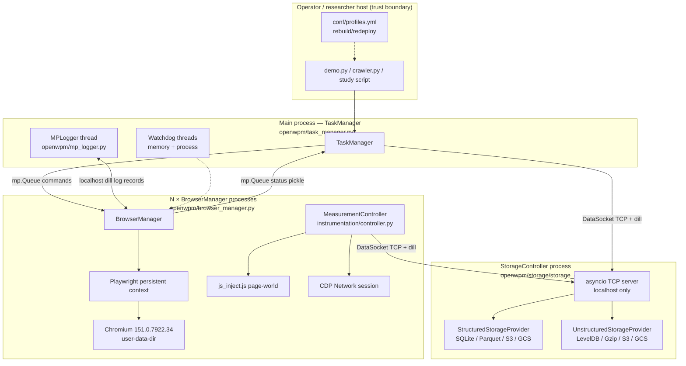
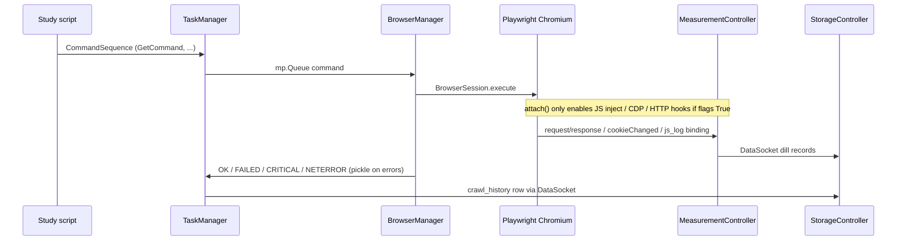
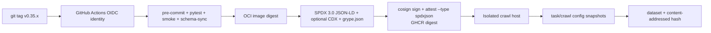

# OpenWPM-1776 Secure Software Engineering Baseline (Increment 1)

| Field | Value |
|-------|-------|
| **Document ID** | OPENWPM-1776-SSE-BL-001 |
| **Document version** | 0.1.3-draft |
| **Date** | 2026-08-24 |
| **Status** | Draft |
| **Classification** | Public |
| **Platform version in scope** | OpenWPM-1776 `VERSION` = **0.35.0** |
| **Engine (live)** | Playwright **1.62.0** + bundled Chromium **151.0.7922.34** |
| **Repository** | https://github.com/code4johnm/OpenWPM-1776 |
| **Workspace** | `/mnt/5TB/git/OpenWPM-1776` |
| **Author** | Engineering (contractor / maintainer baseline) — not an authorizing official |
| **Intended package path** | `openwpm-1776-secure-baseline/` (this document is the increment-1 seed) |
| **Revision** | 0.1.3-draft: Medium nav/DNS re-applied from env after overlay (no purpose); SPDX 3 assert walks `@graph` (not SPDX 2.3 `/packages`) |

---

## Disclaimer (authority limits)

This document is an **engineering / contractor secure-software baseline** for the OpenWPM-1776 research measurement platform. It is:

- **Not** an official U.S. Government issuance.
- **Not** an Authorization to Operate (ATO), and does not grant or imply one.
- **Not** a catalog of collection authorities under Executive Order 12333.
- **Not** a claim of STIG certification, FIPS 140 cryptographic-module validation, Common Criteria, safety, or medical-device certification.
- **Not** an instruction to bypass site authentication, use stolen sessions, attack sites, or exfiltrate data without authorization.

Where this document maps technical choices to NIST, CISA, DoD, or ISO identifiers, those mappings are **publicly citable alignment guidance** for operators and reviewers. They do not create statutory or contractual obligations by themselves. Intelligence Oversight (EO 12333) appears only as a **design constraint**: purpose limitation and data minimization. Measurement exists for **privacy-research integrity**, not for collecting information about U.S. persons.

Statutory department name used throughout: **Department of Defense (DoD)**. “Department of War (DoW)” is noted only as a secondary title some programs may use; this baseline does **not** rewrite DoD policy as DoW policy.

---

## Overview

OpenWPM-1776 is a web privacy measurement platform for large-scale studies (thousands to millions of sites). Live code at 0.35.0 drives **Playwright Chromium** and captures HTTP, cookies, JavaScript API use, navigation, and DNS through Playwright events, Chrome DevTools Protocol (CDP), and a **page-world inject** (`openwpm/instrumentation/js_inject.js`). The Firefox WebExtension, Selenium, and unbranded Firefox build described in several docs **no longer exist**.

The platform is powerful by design: it can record cookie values, POST bodies, JS arguments, screenshots, and full Chromium user-data-dir archives. That capability is the research value and the residual risk. Today’s **code defaults and container image are weaker than the research-grade posture the docs claim**: `BrowserParams.cookie_instrument` defaults to `True`, `display_mode` defaults to `"native"`, the Docker image runs as **root** with `OPENWPM_NO_SANDBOX=1`, images are **unsigned**, and **no SBOM** is produced.

This increment defines an **auditable secure-software engineering baseline** that **extends this repository** (not a greenfield monorepo): three rebuild/redeploy profiles (`dev` / `audit` / `prod`) applied by a **single fail-closed path** (`OPENWPM_PROFILE` / `--profile` / Docker prod entrypoint), a CISA 2026-aligned SPDX **3.0** SBOM+GHCR attest pipeline, a compliance traceability seed, Docker/process hardening (honest always-no-sandbox in containers), and copy-paste-ready skeletons. Implementation is staged as independently reviewable PRs. The existing `docs/Security-and-Privacy.md` is **extended, not replaced**; it is stale relative to 0.35.0 and must be patched as PR 1.

---

## Stakeholders

| Stakeholder | Role relative to this baseline |
|-------------|--------------------------------|
| **Measurement researchers** | Choose instruments and profiles; own the research question, IRB/ethics protocol, and dataset classification. Must opt in to high-sensitivity instruments with documented purpose. |
| **Operators** (lab, cloud, cluster) | Build/run images, pin environments, manage hosts, IAM, retention, and incident response. Consume `docs/operators/` checklists. |
| **Security reviewers** | Assess TCB, STRIDE, SBOM/VEX, signing, Docker, and fail-closed `prod` behavior against this document. |
| **Ethics / IRB** | Confirm purpose limitation, incidental-data handling, and that the platform is not used to study U.S. persons or to collect beyond the approved protocol. |
| **Maintainers / contributors** | Land the PR plan; keep `schema.sql` ↔ `parquet_schema.py` in sync; do not reintroduce Firefox/WebExtension assumptions. |
| **Acquirers (optional)** | If a U.S. Government program adopts a deployment, they apply DoDI 8510.01 and (if designated NSS) CNSSI 1253. This baseline does not assume NSS. |

---

## Background & Motivation

### Current state (verified 2026-08-24 against live code)

| Fact | Evidence |
|------|----------|
| Platform version | Root `VERSION` = `0.35.0` |
| Browser engine | Playwright 1.62.0, Chromium 151.0.7922.34 (`scripts/install-chromium.sh`, `openwpm/browser_bin.py`, `environment.yaml` pip pin, `MIGRATION.md`) |
| Default browser | `BrowserParams.browser = "chromium"`; `"firefox"` rejected (`openwpm/config.py` `SUPPORTED_BROWSER_LIST`) |
| Default display | `display_mode = "native"` |
| Default cookie instrument | `cookie_instrument = True`; all other instruments default `False` |
| `callstack_instrument` | Enabling raises `ConfigError` (`validate_browser_params`) |
| `tracking_protection` | Enabling raises `ConfigError` (Chromium unsupported) |
| Instrumentation path | `MeasurementController` (`openwpm/instrumentation/controller.py`) + `js_inject.js`; **not** `Extension/` |
| Storage | Structured: SQLite / Parquet / S3 / GCS. Unstructured: LevelDB / Gzip / S3 / GCS. Config snapshots in `task` / `crawl` |
| IPC | Localhost TCP; `DataSocket` uses **dill**; MPLogger uses dill; exception status uses **pickle** |
| Docker | `FROM ubuntu:22.04`; `OPENWPM_NO_SANDBOX=1`; `OPENWPM_DISABLE_DEV_SHM=1`; `CMD python demo.py`; **no `USER`**; **no `.dockerignore`** |
| `--no-sandbox` | Only when `CI`, `OPENWPM_NO_SANDBOX=1`, uid 0, or container (`configure_chromium.needs_no_sandbox`) |
| License | GPLv3 (`LICENSE`); Node markdown tooling `package.json` declares `MPL-2.0` (tooling only) |
| Supply chain | `scripts/repin.sh` + pinned `environment.yaml`; conda-forge + PyPI; Playwright Chromium downloaded at install |
| SBOM / signing | **Absent.** `.github/workflows/build-container.yaml` pushes `openwpm/openwpm` by tag/SHA with Docker Hub user/password; digest is printed, not signed |
| Residual disk | `firefox-bin/` gitignored leftover; `ms-playwright/` gitignored; this workspace currently contains **both** |

### Pain points

1. **Documentation lies about the TCB.** `docs/Security-and-Privacy.md`, `docs/Architecture.md`, `docs/Architecture-Internals.md`, `docs/Platform-Architecture.md`, `docs/Installation-Guide.md`, `SECURITY.md`, `docs/Release-Checklist.md`, `docs/Deployment.md`, `docs/version.md`, and parts of `README.md` / `CONTRIBUTING.md` still describe Firefox 0.34.0, a privileged Manifest V2 WebExtension, `scripts/install-firefox.sh`, and `Extension/`. Reviewers following those docs will threat-model the wrong attack surface.
2. **Production-incompatible defaults.** `cookie_instrument=True` and `display_mode="native"` are the dataclass defaults. `demo.py` then turns **on** HTTP, cookie, navigation, JS, and DNS instruments. `crawler.py` env defaults are `COOKIE_INSTRUMENT=1`, `JS_INSTRUMENT=1`, and **`CALLSTACK_INSTRUMENT=1`** (which cannot even start).
3. **Container trust is root + no-sandbox + unsigned.** Combined with no `.dockerignore`, `COPY . .` can ingest leftover `firefox-bin/`, local `ms-playwright/`, `datadir/` (this workspace has `datadir/httpdebug/crawl.sqlite`), and `__pycache__`.
4. **No evidence pipeline.** Releases are not accompanied by SPDX 3 SBOMs, VEX, or cosign signatures. CISA 2026 minimum elements cannot be satisfied from CI today.
5. **Schema drift is a process risk, not a CI gate.** `schema.sql` and `parquet_schema.py` already differ in `instance_id` (Parquet-only) and timestamp columns; there is no CI check.
6. **Localhost dill/pickle is a trusted boundary that is not documented as such in the Chromium-era docs.** A local process that can connect to the StorageController or MPLogger port can deserialize arbitrary objects.

### Why increment 1 is documentation + skeletons + fail-closed profiles

The measurement architecture (process isolation, storage isolation, config snapshots, watchdogs, pinned conda) is already the right TCB shape. Increment 1 **records that architecture accurately**, **tightens defaults for `prod`/`audit`**, and **generates evidence in the same pipeline that produces releases**. It does not invent a new framework, a new SBOM format, or a live profile toggle.

---

## Goals & Non-Goals

### Goals (increment 1)

1. Publish an auditable SSE baseline that senior engineers can implement against live 0.35.0 code.
2. Patch the Firefox/WebExtension documentation drift (patch plan; do not rewrite `Security-and-Privacy.md` in this increment’s implementation PRs beyond the drift fix).
3. Define `dev` / `audit` / `prod` rebuild profiles mapped to real `ManagerParams` / `BrowserParams` fields.
4. Seed a compliance traceability matrix (NIST 800-53 Rev. 5 / 800-53B, SSDF 800-218, C-SCRM 800-161, CISA Secure by Design, CISA 2026 SBOM, SPDX 3.x).
5. Provide copy-paste skeletons: `conf/profiles.yml`, `conf/sbom-policy.yml`, GitHub Actions SBOM+sign fragment, operator checklist, C-SCRM intake template.
6. Specify Docker non-root, `.dockerignore`, `--shm-size`, and documented no-sandbox.
7. Specify log minimization: URLs/errors yes; cookie/token/JS values no in operator logs.
8. Stage work as independently reviewable PRs.

### Non-goals

- Authorization to Operate, STIG certification, FIPS 140 module validation, or CNSSI 1253 overlays (unless a deploying program separately designates the system as NSS).
- Replacing Playwright/Chromium, restoring Firefox, or rewriting instrumentation as a browser extension.
- A live runtime profile switch (profiles are **rebuild/redeploy**).
- A new SBOM format, a new signing scheme, or an in-tree PKI.
- An operator web UI (none exists; OWASP ASVS is N/A — see § Non-applicable standards).
- AI/ML components or AI SBOM elements (N/A unless introduced later).
- Features that steal sessions, bypass authentication, attack measured sites, or cloak `navigator.webdriver` (`configure_chromium.py` explicitly refuses stealth patches).
- Bulk identity stores, subject dossiers, or U.S.-person collection techniques.
- Classified configurations, key material, or exploit methods.
- Safety-critical or medical-device process (IEC 62304, ISO 14971): N/A.

---

## Constraints

| Constraint | Implication |
|------------|-------------|
| **Measurement fidelity vs privilege** | Cookie/JS/body capture requires CDP + page-world inject with access to values. `prod` defaults these **off**; researchers who need them **opt in** with documented purpose. |
| **GPLv3 copyleft** | Downstream redistributors must preserve source offer and license notices. OpenChain ISO/IEC 5230 lineage applies. Node `package.json` `MPL-2.0` covers markdown tooling only and must not be confused with the platform license. |
| **Chromium sandbox in containers** | Live `needs_no_sandbox()` is true for **any** container (`/.dockerenv` or `OPENWPM_DISABLE_DEV_SHM=1`), uid 0, CI, or `OPENWPM_NO_SANDBOX=1`. Increment 1 does **not** change that: Docker Chromium is always `--no-sandbox`. Non-root USER reduces container breakout only. Increment 2 may drop the container auto-branch when user namespaces work. |
| **Localhost dill/pickle trust** | `DataSocket` (`storage_controller.py`) uses `ClientSocket(serialization="dill")`. `mp_logger.py` dill-serializes log records. `BrowserManager` pickles `sys.exc_info()` over `mp.Queue`. Treat the host as the trust boundary; do not expose these ports. |
| **Playwright must not be imported in the parent before fork** | `BrowserManager.run_impl` imports Playwright only in the child (`browser_manager.py`). Profile loaders and CI must not break this. |
| **Pinned Playwright Chromium** | Production crawls use Playwright’s pinned binary, not `OPENWPM_CHROMIUM_EXECUTABLE` (tests/local Chrome-for-Testing only). |
| **No stolen sessions** | README already: “Respect site robots.txt and terms of service. Measurement code does not bypass authentication walls with stolen sessions.” Baseline **reinforces**; does not add session-import features. |
| **Schema dual-write** | SQLite (`schema.sql`) and Parquet (`parquet_schema.py`) must stay aligned. Live drift is larger than `instance_id` (surrogate `id`s, timestamps, `navigations` stamp name, `http_redirects.headers` nullability) — see frozen allowlist. |
| **`callstack_instrument` is dead** | `#557`. Must remain fail-closed. `crawler.py` default `CALLSTACK_INSTRUMENT=1` is a live bug. |

---

## Categorization guidance (FIPS 199 / NIST SP 800-60 style)

This is **guidance for deploying programs**, not a mandate and not a system security plan.

OpenWPM-1776 is a **research measurement platform**. It is not a general-purpose IT system, not a public web service, and not assumed to be a National Security System.

### Information types (SP 800-60 style, research overlay)

| Information type | Examples in this codebase | Confidentiality | Integrity | Availability |
|------------------|---------------------------|-----------------|-----------|--------------|
| Crawl orchestration metadata | `task`, `crawl`, `site_visits`, `crawl_history` | Low–Moderate | **Moderate** | Moderate |
| HTTP URL + header metadata | `http_requests.url`; theoretically headers without secrets | Moderate–High | Moderate | Moderate |
| HTTP POST bodies / Cookie and Authorization headers / saved content | `post_body`, `post_body_raw`, `http_requests.headers` (live capture is all-or-nothing), `save_content` blobs | **High** | Moderate | Moderate |
| Cookie names + **values** | `javascript_cookies.value`; Chromium `Default/Cookies` | **High** | Moderate | Moderate |
| JS values / arguments / stacks | `javascript.value`, `arguments`, `call_stack` | **High** | Moderate | Moderate |
| Screenshots / page source | `data_directory/screenshots`, `sources` | High | Moderate | Moderate |
| Browser profile archives | `profile_archive_dir`, seed/recovery tars | **High** | Moderate | Moderate |
| Operator logs | `manager_params.log_path` | Moderate (High if values leak) | Moderate | Moderate |
| Cloud IAM material | AWS/GCP env, `SENTRY_DSN` | **High** | High | Moderate |
| Platform source + pins | git tag, `environment.yaml`, Playwright revision | Low | **High** | Moderate |

### Recommended impact overlay

- **Confidentiality: High** for any dataset produced with `cookie_instrument`, `js_instrument` (values/args), `http_instrument` (0.35.0 always includes POST bodies and full request headers), or `save_content`. Even with instruments off, screenshots and profile tars can still be High if created by commands.
- **Confidentiality: Moderate** for navigation-only and/or DNS-only crawls (`navigation_instrument` / `dns_instrument`) with High instruments off and no profile dump. URL-only HTTP is **not** a live mode.
- **Integrity: Moderate** for measurement. Poisoned configs, unsigned images, or drifted pins destroy scientific validity. Integrity is not Low.
- **Availability: Moderate** unless the deploying program states an operational SLA (most research crawls do not). Watchdogs and `failure_limit` already trade completeness for host survival.

### 800-53B baseline selection (guidance only)

If a program must pick a 800-53B baseline: start from **Moderate**, then **select additional High confidentiality controls** (SC-8, SC-28, AC-6, SI-12, MP-6, AU-9) whenever High-sensitivity instruments are enabled. Do **not** treat this document as directing a High baseline for every lab laptop running `demo.py`.

**NSS / CNSSI 1253:** apply **only if** the deploying program designates the deployment as a National Security System. This baseline **does not assume NSS** and does not overlay CNSSI 1253.

**DoDI 8510.01:** applies when the acquirer is a DoD component running RMF. This repo does not perform RMF on behalf of DoD.

---

## Security functional requirements

Each SFR maps to NIST SP 800-53 Rev. 5 control IDs and NIST SP 800-218 SSDF v1.1 practice IDs. `T-*` IDs name the requirement; increment-1 PRs that land tests also list the pytest module (see PR Plan).

### Instrumentation & data minimization

| ID | Requirement | 800-53 | SSDF | Tests |
|----|-------------|--------|------|-------|
| **SFR-INSTR-MIN** | `prod` and `audit` overlays default **High** instruments off: `cookie_instrument`, `js_instrument`, `http_instrument` (live capture always includes POST bodies and full request headers, including `Cookie` / `Authorization`), `save_content`. Enabling any of those requires a `research_purpose` string that is non-empty after `strip()` (reject `None` / `""` / missing equally) stored in `custom_params.research_purpose` and thus in `crawl.browser_params`. `navigation_instrument` and `dns_instrument` are **Medium**: default-off in `prod`/`audit` for minimization, but they do **not** require `research_purpose` or High dataset class. `callstack_instrument` remains a hard `ConfigError`. | SI-12, AC-6 | PO.5.1, PW.1.1 | T-INSTR-001 (`test/test_profiles.py`) |
| **SFR-INSTR-FAILCLOSED** | `callstack_instrument=True` and `tracking_protection=True` continue to raise `ConfigError`. `prod` additionally rejects `display_mode="native"` and `browser != "chromium"`. | CM-7, SI-7 | PW.5.1 | T-CFG-001 |
| **SFR-INSTR-CONTAIN** | Page-world JS inject (`js_inject.js`) is loaded only when `js_instrument=True`. CDP `Network.enable` is attached only when HTTP, cookie, or DNS instruments are on (`MeasurementController.attach`). | AC-6, SC-39 | PW.5.1 | T-INSTR-010 |
| **SFR-INSTR-NOSTEALTH** | No CDP cloaking / `navigator.webdriver` hiding. Sites that gate on that bit are a documented measurement limitation (`configure_chromium.py` module docstring). | SA-15 | PW.1.2 | T-INSTR-011 |

### Configuration, snapshots, reproducibility

| ID | Requirement | 800-53 | SSDF | Tests |
|----|-------------|--------|------|-------|
| **SFR-CFG-SNAP** | Every crawl writes `task.manager_params`, `task.openwpm_version`, `task.browser_version`, and per-browser `crawl.browser_params` JSON (`StorageControllerHandle.save_configuration`). `audit`/`prod` CI verifies these rows exist and round-trip to the launched profile. | AU-3, CM-6, AU-10 | PS.3.2, PW.4.1 | T-SNAP-001 |
| **SFR-CFG-PROFILE** | Rebuild profiles live in `conf/profiles.yml` (overlay vs ci_policy vs operator_policy). Fail-closed **only** when an entry point applies the overlay: `crawler.py` if `OPENWPM_PROFILE` is set; `python -m openwpm --profile` **validator** (no crawl); Docker image `ENV OPENWPM_PROFILE=prod` plus entrypoint that runs the same validator then `exec "$@"`. Unset profile = today’s construction path (not prod). High-instrument opt-in on the worker uses `OPENWPM_RESEARCH_PURPOSE` after overlay. | CM-2, CM-6 | PO.5.1 | T-PROF-001 (`test/test_profiles.py`) |
| **SFR-CFG-PIN** | Runtime and build use `environment.yaml` produced only by `scripts/repin.sh`. Floating unpinned deps are forbidden in `prod` images. Playwright remains exactly `1.62.0` until a deliberate repin. SBOM-job tools (syft/grype/cosign) are SHA-pinned actions or checksum-pinned binaries, not `curl \| sh` from `main`. | SA-8, SA-12, CM-8 | PS.1.1, PW.4.1 | T-PIN-001 |
| **SFR-CFG-SCHEMA** | CI fails if `schema.sql` and `parquet_schema.py` **column-name sets** diverge beyond the frozen name allowlist (Parquet `instance_id`; SQLite surrogate `id`; SQL-only timestamps; `navigations.committed_time_stamp` ↔ Parquet `time_stamp`). General SQL `NOT NULL` vs Arrow default-nullable is **out of gating scope** (informational report only). | SI-7, CM-3 | PW.4.2 | T-SCHEMA-001 (`scripts/check-schema-sync.py`) |

### Process isolation, TCB, custom commands

| ID | Requirement | 800-53 | SSDF | Tests |
|----|-------------|--------|------|-------|
| **SFR-ISO-PROC** | TaskManager, each BrowserManager, StorageController, and MPLogger remain separate processes. Browsers do not write structured storage directly. | SC-7, SC-39 | PW.5.1 | T-ISO-001 (existing architecture tests) |
| **SFR-ISO-SOCK** | Storage and log sockets bind `localhost` only (`socket_interface.ServerSocket` binds `("localhost", 0)`). `prod` must not publish these ports. | SC-7, AC-17 | PW.5.1 | T-ISO-002 |
| **SFR-CMD-LOAD** | Increment 1 is **documentation + keep current invariants**: `crawler.py` Redis jobs are URLs/metadata, not pickled callables; do not `exec` queue payloads; `BaseCommand.execute` is arbitrary code in the browser process and must only be imported from reviewed study scripts (`demo.py` / operator modules). Command-module hashing, `--commands-module`, and snapshot hash fields are **increment 2**. | AC-3, CM-7 | PW.1.1 | docs + `test/test_custom_function_command.py` (existing; no pickle-callable jobs) |
| **SFR-WD-DOG** | `prod` enables `memory_watchdog` and `process_watchdog`. Existing `failure_limit` and `incomplete_visits` remain. | SI-5, CP-10 | RV.1.1 | T-WD-001 |

### Container, identity, secrets

| ID | Requirement | 800-53 | SSDF | Tests |
|----|-------------|--------|------|-------|
| **SFR-CTR-USER** | Published `prod` images define a non-root `USER` (and `chown` conda/OpenWPM/Playwright paths before dropping root). Non-root reduces **container** breakout. Increment-1 Docker Chromium is **always** `--no-sandbox` because live `needs_no_sandbox()` is true for any container (`/.dockerenv` or `OPENWPM_DISABLE_DEV_SHM=1`). Unsetting `OPENWPM_NO_SANDBOX` does **not** enable the renderer sandbox. | AC-6, CM-7 | PW.5.1 | T-CTR-001 |
| **SFR-CTR-SHM** | Operator runbooks require `--shm-size=2g` (or larger). Image sets `OPENWPM_DISABLE_DEV_SHM=1` so Chromium adds `--disable-dev-shm-usage` as fallback (`configure_chromium.running_in_container`). | SC-5 | PO.5.2 | T-CTR-002 |
| **SFR-CTR-IGNORE** | A `.dockerignore` excludes `datadir/`, `firefox-bin/`, local `ms-playwright/`, `.git`, tests’ large fixtures unless needed, and secrets. | SA-15, SI-7 | PS.3.1 | T-CTR-003 |
| **SFR-SEC-ENV** | Cloud credentials and `SENTRY_DSN` enter only via environment / secret manager (existing `crawler.py` pattern). Never committed. | IA-5, SC-12, SA-9 | PS.1.1 | T-SEC-001 |

### Supply chain, SBOM, signing

| ID | Requirement | 800-53 | SSDF | Tests |
|----|-------------|--------|------|-------|
| **SFR-SBOM-MIN** | Every GHCR image digest published as `prod`/`audit` has an **SPDX 3.0 JSON-LD** SBOM (`syft -o spdx-json@3.0`, **not** default `spdx-json` which is 2.3) whose properties satisfy the CISA 2026 → SPDX 3 field map (author, timestamp, document version, tool name/version, format name/version, `sbomType` lifecycle, component producer/name/version, PURL, hash+algorithm, license, dependsOn graph, unknowns as `NoAssertion`). CycloneDX 1.6 is optional interchange from the same syft run (`-o cyclonedx-json@1.6`). | SA-12, SR-3, SR-4 | PS.3.1, PS.3.2 | T-SBOM-001 |
| **SFR-SBOM-COVER** | Image SBOM covers conda, pip, npm (markdown tooling), Playwright Chromium **inside the image**, and base Docker layers. CI injects/asserts `pkg:generic/playwright-chromium@151.0.7922.34` with SHA-256 of `chromium_executable()`. | SA-12, CM-8 | PS.3.1 | T-SBOM-002 |
| **SFR-VULN-ARCHIVE** | Increment 1 archives `grype.json` next to the SBOM. Full OpenVEX/CSAF statements (`affected` / `not_affected` / `under_investigation` with justifications) and fail-closed “criticals need a statement” are **increment 2** (former SFR-VEX). Empty `statements: []` stubs must not be described as meeting VEX. | RA-5 | RV.1.1 | T-VULN-001 (artifact exists) |
| **SFR-SIGN** | GHCR image digest is signed keyless (`cosign sign`) and the SPDX 3 file is attached as an in-toto attestation (`cosign attest --predicate … --type spdxjson`). Subject is the **registry digest**, not a local `load:` image. `dev` local builds may skip signing; `audit`/`prod` require verify-attestation. Docker Hub `latest` is **not** a prod artifact. | SC-8, SC-13, SA-10 | PS.2.1, PW.4.4 | T-SIGN-001 |
| **SFR-SMOKE** | CI fails closed if Chromium is missing (`openwpm.browser_bin.chromium_executable`, `python -m openwpm.smoke`). | SI-7 | PW.8.2 | T-SMOKE-001 (exists) |
| **SFR-CSCRM** | Third-party intake records live under `conf/intake/` before adding a new conda/pip/npm/Playwright dependency. | SR-5, SA-12 | PO.1.3, PS.1.1 | T-INTAKE-001 |

### Logging, privacy, IO

| ID | Requirement | 800-53 | SSDF | Tests |
|----|-------------|--------|------|-------|
| **SFR-LOG-MIN** | **Operator logs and Sentry breadcrumbs** may contain URLs, command names, statuses, and errors. They **must not** contain cookie values, `Authorization` / `Cookie` header values, JS `value`/`arguments`, or POST bodies. Dataset tables (`http_requests.headers`, `post_body*`, `javascript_cookies.value`) **remain High** when those instruments are on — PR 6 does **not** redact storage. | AU-2, AU-3, SI-12 | PW.5.1 | T-LOG-001 (`test/test_mp_logger.py`) |
| **SFR-IO-PURPOSE** | Collection is limited to instruments required for the approved research question (**purpose limitation / minimization**). This is a design constraint, not “EO 12333 compliance,” not a collection charter, and not a guarantee of non-incidental collection. Cookie opt-in can still record authentication-equivalent material from public sites; that is the High classification plus an ethics/IRB gate. | SI-12, PL-4 | PO.5.1 | T-IO-001 (protocol/review, not unit) |
| **SFR-RETENTION** | Default operator retention: logs 30 days; High-sensitivity datasets per IRB/protocol (suggested start: 1 year or protocol end, whichever first). No bulk identity store. | SI-12, MP-6 | PO.5.2 | T-RET-001 (docs + operator checklist) |

### Non-applicable domain standards (with rationale)

| Standard | Applicability | Rationale |
|----------|---------------|-----------|
| OWASP ASVS | **N/A** | No operator web UI, no login portal, no internet-facing application. If a future UI is added, ASVS Level 2 becomes in scope. |
| CISA SBOM for AI / AI SBOM minimum elements (2026-05-12) | **N/A** | No in-tree AI model, training pipeline, or inference service. Playwright/Chromium are not treated as “AI components.” Residual `firefox-bin/` leftover must not be shipped. Revisit if ML analysis is added. |
| FIPS 140 / cryptographic module validation as a **product claim** | **N/A** | Platform does not ship a validated crypto module. Operators who need FIPS TLS use host/OS modules independently. |
| IEC 62304 / ISO 14971 / FDA SaMD | **N/A** | Not a medical device. |
| IEC 61508 / ISO 26262 | **N/A** | Not a safety-critical control system. |
| CNSSI 1253 | **Conditional** | Only if the deploying program designates NSS. Not assumed. |
| PCI DSS | **N/A** | Platform is not a cardholder-data environment. Incidental PAN in crawled pages is a dataset-handling issue, not a PCI role. |

Commercial alignment that **does** apply as process references (not certifications): ISO/IEC/IEEE 12207 and 15288 (life cycle), ISO/IEC/IEEE 29119 (test process for the T-\* placeholders), ISO/IEC 27001/27034 as organizational overlays, OpenChain ISO/IEC 5230 for GPLv3 license compliance, CERT Python secure coding for the Python TCB.

---

## Proposed Design

### Architectural principles

1. **Minimize TCB; isolate browsers and storage** — already present (`TaskManager` / `BrowserManager` / `StorageController`). Document and harden; do not merge processes.
2. **Separate immutable platform code from mutable crawl state** — source + pins vs `datadir/`, Chromium profiles, cloud buckets.
3. **Default deny instruments and admin surfaces in `prod`.**
4. **Generate evidence in the same pipeline that produces releases** (SBOM, VEX, signature, smoke, schema check).
5. **Fail closed in `prod`; fail observable in `dev`.**
6. **Collect only instruments required for the approved research question.**
7. **Hermetic/pinned releases** (`repin.sh`, lockfiles, recorded Playwright/Chromium versions).
8. **Secrets never in git; env vars only** (existing `crawler.py` pattern).

### Logical architecture (live 0.35.0, not Firefox)



**Delta vs stale docs:** there is no Selenium WebDriver, no Firefox, no XPI, no `extension_port.txt`, no `experiment_apis`. `extension_socket` in `BaseCommand.execute` is now a `MeasurementController` (historical parameter name in `openwpm/commands/types.py`). `docs/Architecture-Internals.md` still claims “Extension → StorageController TCP JSON”; live `MeasurementController` uses the same **dill** `DataSocket` as the platform (`storage_controller.py` `ClientSocket(serialization="dill")`). PR-1 patches that JSON-vs-dill drift.

### Trust boundaries

| Boundary | Inside | Outside | Control |
|----------|--------|---------|---------|
| **Host** | All OpenWPM processes, localhost sockets, Chromium children, tmp profiles | Measured sites, network path, cloud APIs | Dedicated measurement hosts; no personal browsing profiles |
| **Browser process** | Chromium renderer/GPU/network + page JS | TaskManager | OS process isolation; Playwright persistent context per BrowserManager |
| **Page world vs controller** | `js_inject.js` runs in the page; `expose_binding("__openwpm_js_log__")` is the bridge | Site JS | Binding is privileged relative to the page; only attach when `js_instrument=True` |
| **CDP** | `Network.enable`, `cookieChanged`, cache/DNS extras | Site | CDP is equivalent to a debugging surface; only attach when HTTP/cookie/DNS instruments on |
| **Storage socket** | dill-decoded records | Any local PID that can connect | Bind localhost; do not publish; host equals TCB |
| **Cloud** | s3fs / gcsfs with env credentials | Bucket ACLs, IAM | Least-privilege roles; no keys in git |
| **Supply chain** | Pinned conda/pip/npm + Playwright revision | Indexes, GitHub Actions, Docker Hub | Allowlisted indexes; OIDC signing; SBOM |

### TCB inventory (what we must trust)

| Component | Path | Why it is TCB | Residual risk |
|-----------|------|---------------|---------------|
| TaskManager | `openwpm/task_manager.py` | Orchestration, config snapshot, watchdogs | Command dispatch; failure accounting |
| BrowserManager + deploy | `openwpm/browser_manager.py`, `deploy_browsers/deploy_chromium.py` | Launches Chromium, executes **arbitrary** `BaseCommand.execute` | Custom commands are code execution |
| MeasurementController + inject | `openwpm/instrumentation/controller.py`, `js_inject.js` | Sees cookies, POST bodies, JS values | Highest data-sensitivity surface |
| Chromium + Playwright | `ms-playwright/`, pip `playwright==1.62.0` | Browser + automation; sandbox may be off | Compromised pin = compromised crawl **and** host (especially no-sandbox) |
| StorageController + providers | `openwpm/storage/*` | Persistence of High data | dill deserialize; cloud IAM |
| socket_interface | `openwpm/socket_interface.py` | dill.loads on localhost | Classic pickle RCE if boundary broken |
| MPLogger | `openwpm/mp_logger.py` | Aggregates logs; optional Sentry | Dill; possible sensitive log lines |
| Config validation | `openwpm/config.py` | Enum/`ConfigError` checks | Short-circuit `if BrowserParams() == browser_params: return` skips type/enum/dead-flag checks on unmodified defaults. It is **not** why `cookie_instrument=True` is allowed (there is no extra check on that field). Fail-closed prod is the loader + entry points, not this short-circuit. |
| Conda env + Node tooling | `environment.yaml`, `package-lock.json` | Runtime + docs tooling | Transitive CVEs |
| Docker base | `ubuntu:22.04` | Image TCB | Unsigned today; root today |

**Out of TCB (must stay out):** study scripts’ measured sites; Tranco lists; researcher laptops used for email; leftover `firefox-bin/` (must not be shipped).

### Sequence: command + instrumentation (Chromium)



### Profiles (rebuild/redeploy)

Profiles are **YAML applied at crawl-script construction time** (and baked into `prod` images). Changing profile requires rebuild/redeploy, not an env flip mid-crawl.

| | `dev` | `audit` | `prod` |
|---|-------|---------|--------|
| `display_mode` | `native` allowed | `headless` or `xvfb` | `headless` or `xvfb` only |
| Instruments | Researcher-chosen; dataclass defaults unless `--profile` | High instruments off unless `research_purpose`; nav/DNS default-off, no purpose required | High instruments **off** unless purpose; nav/DNS default-off |
| `cookie_instrument` | may be True | off unless purpose | **off** |
| Storage | local SQLite + optional LevelDB | local or cloud with snapshot tests | cloud or encrypted volume; env credentials only |
| Watchdogs | optional | on | on |
| Signing | optional locally | required | required |
| SBOM | if the artifact is published | required + signed | required + signed |
| User in image | unspecified | non-root | non-root |
| Custom commands | examples OK | reviewed study scripts only | same; hashing is increment 2 |
| Fail behavior | observable (warnings) | closed on overlay miss | closed on overlay miss |

**Scientific trade-off (mandatory):** turning `cookie_instrument` off in `prod` means **cookie-value studies are not the default crawl**.

**Chosen opt-in path (increment 1): (a)** `OPENWPM_RESEARCH_PURPOSE` plus High-instrument env vars applied **after** the overlay, still subject to `_purpose_ok`. Rejected as the *only* path: (b) bind-mount of a forked `profiles.yml`; (c) rebuild-only image. (b) remains an optional extra via `OPENWPM_PROFILES_FILE` for study YAML; (c) is allowed but not required.

On `crawler.py` and the published image:

1. Select `audit` or `prod` via `OPENWPM_PROFILE` (entrypoint / env).
2. Set `OPENWPM_RESEARCH_PURPOSE` to a non-empty stripped string (IRB/protocol id). That value is copied into `custom_params.research_purpose`.
3. Set `COOKIE_INSTRUMENT=1` / `HTTP_INSTRUMENT=1` / `JS_INSTRUMENT=1` / `SAVE_CONTENT=1` as needed. These env bits are **re-applied after** `apply_profile` so they are not clobbered by the overlay.
4. `enforce_overlay_policy()` runs last: High instruments remain `ConfigError` if purpose is empty; `display_mode` still cannot be `native`; `callstack_instrument` still cannot be true.
5. Classify the dataset **High**; accept IRB/ops handling for authentication-equivalent material (incidental data about persons is possible; this is not a collection charter).

Docker cookie study (no platform bind-mount):

```bash
docker run --rm --shm-size=2g \
  -e OPENWPM_PROFILE=prod \
  -e OPENWPM_RESEARCH_PURPOSE='protocol-ID cookie-sync' \
  -e COOKIE_INSTRUMENT=1 \
  -v "$PWD/datadir:/opt/OpenWPM/datadir" \
  ghcr.io/org/repo@sha256:… \
  python crawler.py
```

The same **High + purpose** pattern applies to `js_instrument`, `http_instrument` (live `_record_request` always stores `post_body*` and full headers including `Cookie`/`Authorization` — therefore High; URL-only HTTP is **not** available in 0.35.0), and `save_content`. Navigation/DNS studies are Medium: default-off in `prod` for minimization, **no** `research_purpose` required.

### Fail-closed application path (single path — increment 1)

YAML on disk does **not** enforce prod. Increment 1 has **one** application path:

| Entry point | How the overlay is applied | If profile unset |
|-------------|----------------------------|------------------|
| **`crawler.py`** (Redis/GCS worker — a prod entry point **when profile is set**) | Sequence below. | Keep live env defaults (`HTTP/COOKIE/JS/NAV=1`) except the CALLSTACK bugfix (`"0"`). |
| **`python -m openwpm --profile {dev,audit,prod}`** | **Validator only** (see API). Exit 0/1. Does **not** crawl, open Chromium, or construct `TaskManager`. | `--profile` required; missing flag → usage error, exit 2. |
| **Docker image (single Dockerfile)** | `ENV OPENWPM_PROFILE=prod`. Entrypoint runs the validator then `exec "$@"`. Default `CMD` is `python -m openwpm.smoke`. | N/A — image always sets the env. Operators override with `-e OPENWPM_PROFILE=dev` for demo. |

`crawler.py` sequence when `OPENWPM_PROFILE` is `prod` or `audit`:

```
1. Construct ManagerParams / BrowserParams()
2. Assign DISPLAY_MODE and instrument env vars (live defaults)
3. apply_profile(name)           # overlay wins: High + Medium instruments off
4. ALWAYS re-apply NAVIGATION_INSTRUMENT and DNS_INSTRUMENT from env
     (Medium; no research_purpose required)
5. purpose = OPENWPM_RESEARCH_PURPOSE.strip()
6. if purpose:
      custom_params["research_purpose"] = purpose
      re-apply COOKIE/HTTP/JS/SAVE_CONTENT from env   # High; purpose-gated
7. enforce_overlay_policy()      # fail closed if High on without purpose
                                 # nav/DNS may be on with empty purpose
```

PR 2b adds `DNS_INSTRUMENT` (live `crawler.py` has no such env; dataclass default is already `False`). Default remains unset/`"0"` so overlay-off + no env keeps DNS off. `NAVIGATION_INSTRUMENT` already exists (live default `"1"`), so a profiled worker that keeps that default gets nav back on after step 4 without purpose.

`demo.py` stays a **dev** demonstration (instruments on). Changing Docker `CMD` away from `demo.py` is required so a published image cannot be mistaken for an instrumented demo crawl. Hub `latest` after PR 3 may **carry the prod overlay** (unsigned) — that is not a signed prod **artifact** (KD 18).

Do not import Playwright in `openwpm/security/profiles.py` (fork constraint in `BrowserManager.run_impl`).

### Thin profile loader

Keep it small: `openwpm/security/profiles.py` only. No OPA/plugin framework.

- Load YAML; overlay **only** `overlay.manager` / `overlay.browser` onto `ManagerParams` / `BrowserParams`.
- Call existing `validate_*` (remove the equality short-circuit so unmodified defaults still get enum/dead-flag checks — that is **not** the prod fail-closed mechanism).
- Then `apply_profile` overlay checks for `audit`/`prod`.
- `ci_policy` and `operator_policy` are **not** enforced by this function.

```python
# openwpm/security/profiles.py
from pathlib import Path
from typing import List, Optional
from openwpm.config import BrowserParams, ManagerParams
from openwpm.errors import ConfigError

HIGH_INSTRUMENTS = (
    "cookie_instrument",
    "js_instrument",
    "http_instrument",
    "save_content",
)

def _purpose_ok(browser: BrowserParams) -> bool:
    raw = (browser.custom_params or {}).get("research_purpose")
    return isinstance(raw, str) and raw.strip() != ""

def apply_profile(name: str, manager: ManagerParams, browsers: List[BrowserParams]) -> None:
    """Overlay named profile. Raise ConfigError if audit/prod overlay policy violated.

    Does not check ci_policy or operator_policy (CI job / operator checklist / entrypoint env).
    """
    ...

def load_profile(
    name: str,
    *,
    conf_path: Path = Path("conf/profiles.yml"),
    num_browsers: Optional[int] = None,
) -> tuple[ManagerParams, List[BrowserParams]]:
    """Construct params from overlay; omitted fields inherit dataclass defaults."""
    ...
```

`prod`/`audit` **overlay** checks (`ConfigError`) — only these:

- `display_mode in {"headless", "xvfb"}`
- `browser == "chromium"`
- `callstack_instrument is False` and `tracking_protection is False`
- each of `HIGH_INSTRUMENTS` is False **or** `_purpose_ok`
- `testing is False`
- `memory_watchdog` and `process_watchdog` True

Omitted YAML fields **inherit dataclass defaults** (`js_instrument_settings`, `locale`, `timezone_id`, `tmp_profile_dir`, `recovery_tar`, `data_directory`, `log_path`, `failure_limit`, …).

### Policy planes (do not mix in `apply_profile`)

| Plane | Keys | Owner | Failure mode |
|-------|------|-------|--------------|
| **overlay** | ManagerParams / BrowserParams field assignments + overlay checks above | `apply_profile` in crawler/CLI/entrypoint | `ConfigError` |
| **ci_policy** | `require_signed_image`, `require_sbom`, `require_config_snapshot_tests`, `allow_floating_deps` | `.github/workflows/sbom-sign.yml` promote/verify job | CI red |
| **operator_policy** | `require_non_root_container`, `require_shm_size`, `forbid_OPENWPM_CHROMIUM_EXECUTABLE`, `forbid_interactive_debug`, `cloud_credentials`, Sentry breadcrumb level | checklist + Docker entrypoint env (`LOG_LEVEL_SENTRY_BREADCRUMB=ERROR`; refuse `OPENWPM_CHROMIUM_EXECUTABLE` if set in prod) | entrypoint exit / checklist |

### Docker hardening design

Current `Dockerfile` issues: root, `COPY . .` with **no `.dockerignore`**, `CMD python demo.py` (demo enables High instruments), `OPENWPM_NO_SANDBOX=1` always.

**Increment-1 honesty on the sandbox:** live `needs_no_sandbox()` returns True if `CI`, if `OPENWPM_NO_SANDBOX=1`, if uid 0, **or** `running_in_container()` (`/.dockerenv` **or** `OPENWPM_DISABLE_DEV_SHM=1`). The image keeps `OPENWPM_DISABLE_DEV_SHM=1` (required so Chromium uses `--disable-dev-shm-usage` when `/dev/shm` is tiny). Therefore **any increment-1 Docker Chromium process is `--no-sandbox` / `chromium_sandbox=False`**, including non-root `USER openwpm`. Unsetting `OPENWPM_NO_SANDBOX` is a **no-op** for the sandbox. Do not ship an entrypoint that pretends otherwise.

PR 3 **must** edit `openwpm/deploy_browsers/configure_chromium.py` to document this in the `needs_no_sandbox()` docstring (behavior unchanged in increment 1). Tightening the function so non-root user-namespace containers can run a sandbox is **increment 2**, with `OPENWPM_NO_SANDBOX=1` as the K8s escape hatch.

Target `prod` image:

1. Add `.dockerignore`: `.git`, `datadir/`, `firefox-bin/`, `ms-playwright/`, `docker-volume/`, `**/__pycache__`, `.crosslink/`, local secrets, `evidence/`.
2. `COPY` only what install needs (`environment.yaml`, `install.sh`, `scripts/`, `openwpm/`, `schemas/`, `VERSION`, `pyproject.toml`, `conf/`).
3. After `./install.sh` (runs as root), `useradd -r -m -u 10001 openwpm` and **`chown -R`** `/opt/OpenWPM`, `/opt/ms-playwright`, and the conda prefix (`$HOME/conda` = `/opt/conda` given `ENV HOME /opt`) **before** `USER openwpm`. A naive `USER` without chown fails Playwright/conda writes.
4. Keep `OPENWPM_DISABLE_DEV_SHM=1` and `OPENWPM_NO_SANDBOX=1` (honest; matches `needs_no_sandbox()`). Document residual renderer-sandbox absence. Non-root reduces container breakout, not renderer sandbox.
5. `ENV OPENWPM_PROFILE=prod` and `ENV LOG_LEVEL_SENTRY_BREADCRUMB=ERROR`. Single Dockerfile (no `AS prod` target). `build-container.yaml` Hub `latest` will therefore run the prod **overlay** after PR 3; it remains an **unsigned** artifact (KD 18). Operators who want demo-in-container pass `-e OPENWPM_PROFILE=dev`.
6. `ENTRYPOINT ["/opt/OpenWPM/scripts/docker-entrypoint.sh"]`; `CMD ["python", "-m", "openwpm.smoke"]` — **not** `demo.py`.
7. Operator `docker run` requires `--shm-size=2g` (cannot be enforced from inside the entrypoint), resource limits, bind-mount **only** `datadir`. `--shm-size` and non-root are operator_policy / checklist.

**Entrypoint (copy-paste):** smoke does not construct `BrowserParams`. The entrypoint is an image self-check, then `exec` of CMD.

```bash
#!/usr/bin/env bash
# scripts/docker-entrypoint.sh
set -euo pipefail
PROFILE="${OPENWPM_PROFILE:-prod}"
if [[ -n "${OPENWPM_CHROMIUM_EXECUTABLE:-}" && ( "$PROFILE" == prod || "$PROFILE" == audit ) ]]; then
  echo "OPENWPM_CHROMIUM_EXECUTABLE is forbidden when OPENWPM_PROFILE=$PROFILE" >&2
  exit 1
fi
# Validator only: no TaskManager, no Playwright in this process.
python -m openwpm --profile "$PROFILE"
exec "$@"
```

**Bind-mount vs copy:** `prod` **copies** platform code into the image (immutable). `dev` **may** bind-mount the source tree. Bind-mounting `/opt/OpenWPM` in prod lets a host-side attacker replace `custom_command.py` after the image is signed. Optional: bind-mount **only** `OPENWPM_PROFILES_FILE` (a study YAML) — not the platform tree.

### Trust chain (release → dataset)



Operators publishing results record: git tag/commit, image digest, SBOM digest, cosign bundle, `task.openwpm_version`, `task.browser_version`, and a hash of the structured store.

### Data / state model

Reuse Security-and-Privacy.md **§3.4** sensitivity classes (patch that section to add Chromium paths). Do not invent a parallel taxonomy.

| Artifact | Live path / table | Sensitivity | Retention default |
|----------|-------------------|-------------|-------------------|
| Config snapshots | `task`, `crawl` | Low–Mod (may include paths) | Life of dataset |
| Visit metadata | `site_visits`, `crawl_history`, `incomplete_visits` | Low–Mod | Life of dataset |
| HTTP | `http_requests` (incl. `post_body*`, `headers` with Cookie/Authorization), `http_responses`, `http_redirects` | **High** (0.35.0 always captures bodies+headers when `http_instrument` is on; URL-only not available) | Protocol |
| JS | `javascript.value`, `arguments`, `call_stack` | Very High | Protocol; minimize |
| Cookies | `javascript_cookies.value` | Very High | Protocol |
| DNS | `dns_responses` | Medium | Protocol |
| Navigations | `navigations` | Medium | Protocol |
| Screenshots / sources | `manager_params.data_directory/{screenshots,sources}` | High | Protocol |
| Chromium profile | `{tmp_profile_dir}/chromium_profile_*` with `Default/Cookies`, `Default/History`, `Default/Preferences`, `Local State`; archives via `dump_profile` | Very High | Delete on crawl end unless `profile_archive_dir` |
| Saved bodies | unstructured provider keyed by MD5 `content_hash` | High | Protocol |
| Operator log | `manager_params.log_path` | Moderate (must not hold cookie/JS values) | 30 days |
| Playwright cache | `ms-playwright/` (gitignored) | Low (binaries) | Rebuild |
| Leftover Firefox | `firefox-bin/` (gitignored) | High residual (NSS libs, old engine) | **Delete**; never copy into images |

**No bulk identity stores.** There is no user table. Do not add one.

`dump_profile` (`openwpm/commands/profile_commands.py`) tars the **entire** user-data-dir. `REQUIRED_PROFILE_ITEMS` are `Default/Preferences` and `Local State` — cookies/history appear after first use. Treat any tar as a full browser backup.

### Authorization / least privilege

| Surface | Least privilege rule |
|---------|----------------------|
| Instruments | High instruments default off in `prod`/`audit`; purpose string to enable High ones. Nav/DNS default-off without purpose. |
| Storage backends | SQLite file mode 0600; S3/GCS roles limited to one prefix (`CRAWL_DIRECTORY`); no account-wide keys |
| Custom commands | `BaseCommand.execute` is arbitrary code in the browser process. Increment 1: do not pickle callables; do not `exec` Redis payloads (already true for `crawler.py` — keep it). Study scripts may import `custom_command.py` like `demo.py`. Module hashing / `--commands-module` / snapshot hash field = **increment 2**. |
| `crawler.py` Redis jobs | Jobs are URLs + metadata, not pickled callables. Keep it that way. |
| Sentry | Optional; `SENTRY_DSN` from env. Prod overlay/operator_policy sets `LOG_LEVEL_SENTRY_BREADCRUMB=ERROR` (live MPLogger default is DEBUG). SFR-LOG-MIN applies to breadcrumbs. |
| GitHub Actions | SBOM/sign job: `id-token: write`, `contents: read`, `packages: write` for **GHCR**. Docker Hub password publish of `openwpm/openwpm:latest` remains unsigned and is **not** prod. |

### Networking / exposure

| Flow | Direction | Notes |
|------|-----------|-------|
| Measured sites | Egress HTTPS/HTTP/DNS from Chromium | Expected; coordinate with network operators |
| Cloud storage | Egress to S3/GCS endpoints | IAM-scoped |
| Sentry / Tranco | Egress if enabled | Optional |
| Operator web UI | **None** | No inbound application |
| StorageController / MPLogger | Localhost TCP ephemeral ports | Must not be published (`-p` in Docker) |
| Playwright | Local Chromium child | Not a network service |
| Redis job queue (`crawler.py`) | Operator-provided | Treat Redis as trusted infra; AUTH + TLS in `prod` |

### Key hierarchy

**Do not publish key material in this document or the repo.**

| Key / identity | Use | Storage |
|----------------|-----|---------|
| GitHub Actions OIDC token | cosign keyless `sign` + `attest` of **GHCR** digest | Ephemeral; Fulcio + Rekor |
| GHCR | Increment-1 signed source of truth | `GITHUB_TOKEN` + `packages: write` |
| Docker Hub | Existing unsigned `openwpm/openwpm:latest` (not prod) | `DOCKERHUB_*` secrets — residual; do not treat as signed |
| AWS/GCP runtime | s3fs/gcsfs | Instance role / `AWS_*` / `GOOGLE_APPLICATION_CREDENTIALS` file **outside** git; `crawler.py` `AUTH_TOKEN` env |
| Sentry DSN | Error reporting | Env only |
| Dataset encryption keys | Operator-managed at-rest encryption | Operator KMS; not an OpenWPM feature in increment 1 |

Release signing keys are **not** the same as cloud runtime credentials. Compromise of a crawl VM must not yield the ability to sign a new `prod` image (OIDC is scoped to the GitHub workflow).

### Observability and IO / minimization

**Operator logs (allow):** OpenWPM version, Chromium version, profile name, URLs of visits, command names, statuses (`ok`/`timeout`/`neterror`), neterror codes (`dnsNotFound`), durations, watchdog events, storage queue depth.

**Operator logs and Sentry breadcrumbs (deny):** `javascript_cookies.value`, JS `value`/`arguments`, `post_body` / `post_body_raw`, `Authorization` / `Cookie` **header values**, screenshot pixels, profile tar contents.

**Dataset (not in PR 6 scope):** when `http_instrument` is on, `http_requests.headers` **does** store `Cookie` and `Authorization`. Cookie/HTTP studies must treat the **dataset** as High. PR 6 redacts **logs/Sentry only**.

Live-code notes for PR 6:

- `MeasurementController` currently `logger.exception` on HTTP capture failure without dumping bodies — acceptable.
- `_record_js_messages` / `_save_cookie_record` write values to **storage**, not logs — acceptable; keep them there.
- `get_configuration_string` (`openwpm/utilities/platform_utils.py`): add `verbose: bool = True`. `prod`/`audit` call with `verbose=False` and log only `openwpm_profile` + instrument booleans + versions. Full JSON remains in `task`/`crawl` snapshots.
- `BrowserManager` logs `EXECUTING COMMAND: %s` via `str(command)` — commands must not put secrets in `__repr__`.
- `crawler.py` Sentry tags include `JS_INSTRUMENT_SETTINGS` — OK; must not tag cookie values.
- `MPLogger` defaults `log_level_sentry_breadcrumb=logging.DEBUG`. Prod Docker/`operator_policy` sets env `LOG_LEVEL_SENTRY_BREADCRUMB=ERROR` **before** `TaskManager` constructs MPLogger (`crawler.py` already uses `mp_logger.parse_config_from_env()`). Regression: a known cookie value must not appear in `openwpm.log` or Sentry breadcrumb fixtures.

**Purpose limitation / minimization:** datasets are for the approved privacy-research question. This is not “EO 12333 compliance,” not a collection charter, and not a guarantee that crawled public pages contain no incidental personal data. Operators delete or redact when the protocol ends.

### Update / recovery

| Concern | Existing mechanism | Baseline addition |
|---------|--------------------|-------------------|
| Platform pins | `scripts/repin.sh`; **`scripts/update.py` `main()` is already Chromium** (repin, pre-commit sync, npm bump, remind `install-chromium.sh`) | Record Playwright/Chromium versions in SPDX 3 SBOM. PR-1: delete or stop documenting unused `sync_extension_node_engine()` (`Extension/package.json`); fix `bump_version_if_behind` comment “each new Firefox gets a new minor.” |
| Browser crash | `BrowserManagerHandle` recovery tar from current profile; spawn limit 4 | Unchanged; profiles contain cookies — treat recovery tars as High |
| Command failures | `failure_limit` default `2 * num_browsers + 10`; DNS NXDOMAIN excluded (`is_dns_error`) | Unchanged |
| Incomplete visits | `incomplete_visits` table | Unchanged; forensics |
| Storage isolation | StorageController survives browser death | Unchanged |
| Long crawls | `memory_watchdog`, `process_watchdog`, `maximum_profile_size` | Enabled in `prod`/`audit` |
| Smoke | `python -m openwpm.smoke` fail-closed if binary missing | Gate releases |

### Docs patch plan (`docs/Security-and-Privacy.md` — extend, do not replace)

Increment 1 **does not rewrite the entire file**. PR-1 applies a surgical patch:

1. Header: OpenWPM Version **0.35.0**; drop Firefox 0.34.0.
2. §1 / §2: replace “privileged WebExtension” with “Playwright/CDP + page-world inject (`js_inject.js`)”.
3. §3.1 asset #5: “Playwright Chromium pin + conda env”, not “Firefox build / extension artifacts”.
4. §3.3 Elevation of Privilege: compromised inject/CDP/custom command, not “compromised extension”.
5. §3.4: add Chromium profile paths (`Default/Cookies`, `Default/History`, `Local State`).
6. Replace **§6 WebExtension Security Analysis** with **§6 Instrumentation attack surface (Playwright / CDP / js_inject.js)** (new STRIDE rows below). Keep residual-risk table style.
7. §4.1 / §4.4: `install-chromium.sh` not `install-firefox.sh`; SBOM/signing still gaps until PRs 4–5.
8. §9: replace Manifest V2 / `unsafe-eval` / Marionette roadmap with Chromium-era limitations (Docker Chromium always no-sandbox, dill localhost, Docker root, unsigned images, schema drift, leftover `firefox-bin/`).
9. §10 item 5–8: strike “lower-privilege Firefox Marionette + CDP” as the primary path — **CDP is already the path**. Rephrase as “continue to minimize when CDP is attached”.
10. Purpose-limitation language only; do not write a collection charter or “EO 12333 compliance.” Cookie opt-in remains an ethics/IRB gate.

Parallel patches (PR 1 file list — complete):

- `SECURITY.md` — supported versions 0.35.x; drop WebExtension from scope
- `docs/Release-Checklist.md` — Playwright install, no `Extension/` rebuild, no `install-firefox.sh`
- `docs/Architecture.md`, `docs/Architecture-Internals.md` — process diagrams; **JSON-vs-dill**: instrumentation uses dill `DataSocket`, not Extension TCP JSON
- `docs/Platform-Architecture.md` — still claims collection happens in `Extension/`; patch
- `docs/Installation-Guide.md` — header still 0.34.0 + “privileged WebExtension / specially built Firefox”; patch
- `docs/Deployment.md` — Chromium `--shm-size`, non-root, sandbox honesty
- `docs/Configuration.md` — remove remaining `browser: firefox` / “only firefox is supported” (line ~104)
- `docs/version.md` — base 0.35.0
- `CONTRIBUTING.md` — remove `Extension/` rebuild; `scripts/update.py` is Chromium
- `README.md` — Security section WebExtension sentence
- `scripts/update.py` — remove or isolate unused `sync_extension_node_engine()`; Firefox comment in `bump_version_if_behind`
- Grep-gate: fail PR 1 if `docs/` still contains `install-firefox.sh` or “only \`firefox\` is supported” (except historical CHANGELOG)

**If a section of Security-and-Privacy.md contradicts live code, live code wins** and the doc is marked stale until PR-1.

### Threat model (extends Security-and-Privacy.md; Chromium-era STRIDE)

Assets and adversaries in §3.1–3.2 remain valid. Update asset “Platform Supply Chain” to Playwright/Chromium/conda. Add adversary: **malicious page attacking the inject/CDP bridge**.

| Threat | Component | Example | Mitigation | Severity |
|--------|-----------|---------|------------|----------|
| **Spoofing** | Measured web | Site impersonates first party; measurement poison | Inherent; Tranco + post-processing | Medium (integrity of science) |
| **Tampering** | `js_inject.js` | Page redefines accessors, detects instrumentation, lies | Inject via `add_init_script` before page scripts; accept residual detection; no stealth | Medium |
| **Tampering** | Unsigned image / unpinned env | Attacker replaces Chromium or pip wheel | SBOM + cosign + `repin.sh` | **High** |
| **Repudiation** | Missing snapshots | Cannot prove which instruments produced a dataset | `task`/`crawl` JSON; `audit` tests | Medium |
| **Info disclosure** | `javascript_cookies`, JS values, POST | Dataset or logs leak auth material | Instrument minimization; log deny-list; encryption at rest; dedicated hosts | **High** |
| **Info disclosure** | Profile tar / `Default/Cookies` | Operator copies tar off-box | Treat as browser backup; `prod` default no `profile_archive_dir` | **High** |
| **Info disclosure** | Cloud IAM | Over-broad S3/GCS token | Env-only creds; prefix-scoped roles | High |
| **DoS** | Chromium | Memory/disk blowup | Watchdogs, `maximum_profile_size`, Docker limits, `--shm-size` | Medium |
| **EoP** | `js_inject.js` + `expose_binding` | Page-world script tricks the binding into extra privileges | Binding only logs structured messages; still a privileged bridge; dedicated hosts | High |
| **EoP** | CDP `Network.enable` | CDP is a debugger; page + bug → broader control | Attach CDP only when instruments need it; no extra CDP domains | High |
| **EoP** | dill `loads` on StorageController / MPLogger | Local process sends `"d"`-prefixed payload → RCE in storage/logger process | Localhost only; host hardening; consider JSON-only in a future increment (see alternatives) | **High** |
| **EoP** | pickle on `status_queue` | Cross-process exception unpack (`pickle.loads`) | Same-host `mp.Queue`; do not replace with network pickle | High |
| **EoP** | `BaseCommand.execute` | Malicious custom command drives Playwright | Increment 1: no pickle-callable jobs; reviewed study scripts | High |
| **EoP** | Docker root + `--no-sandbox` | Chromium renderer bug → container root **or** (non-root) container user | Non-root reduces uid 0 breakout; **renderer sandbox stays off in Docker** in increment 1; gVisor/Firecracker optional at operator layer | **High** |
| **EoP** | Compromised Playwright/Chromium pin | Supply-chain implant in browser binary | Pin + SBOM hash of Chromium executable; smoke; cosign image | **High** |
| **EoP** | Leftover `firefox-bin/` | Old NSS/libs / unexpected binary on disk or in image | `.dockerignore`, operator wipe, gitignore already | Medium |

---

## API / Interface Changes

Increment 1 prefers YAML + validation over a large new API.

### BrowserParams / ManagerParams (no field renames)

Live fields in `openwpm/config.py` remain the interface. Profiles only **set** them.

Optional additive field (if a code change is accepted in PR-2):

```python
# BrowserParams.custom_params already exists as Dict[Any, Any]
# Convention (not a new dataclass field):
#   custom_params["research_purpose"] = "cookie-sync study protocol #…"
#   custom_params["openwpm_profile"] = "prod"
```

Avoid a new required dataclass field in increment 1 to keep `dataclasses_json` snapshots backward compatible.

### Validation change (required)

```python
# TODAY (openwpm/config.py) — skips validation on unmodified defaults
def validate_browser_params(browser_params: BrowserParams) -> None:
    if BrowserParams() == browser_params:
        return
    ...

# TARGET — always validate; prod overlay applied separately
def validate_browser_params(browser_params: BrowserParams) -> None:
    # no equality short-circuit
    ...
```

Same for `validate_manager_params`. Removing the short-circuit means unmodified defaults still get **type/enum/dead-flag** checks (`display_mode`, `browser`, `callstack_instrument`, `tracking_protection`, `save_content` resource types). It does **not** reject `cookie_instrument=True` — there is no such check. Prod fail-closed lives in `apply_profile` + entry points.

### CLI (`python -m openwpm`) — validator, not a crawler

Live `openwpm/__init__.py` is empty; there is no `__main__.py`. `python -m openwpm.smoke` remains the smoke crawl. Increment 1 adds `openwpm/__main__.py` as a **fail-closed validator** so the Docker entrypoint and operators can prove a profile loads without inventing a crawl runner.

```text
python -m openwpm --profile prod
python -m openwpm --profile prod --conf conf/profiles.yml
# exit 0: overlay OK; prints openwpm_profile + instrument booleans + versions
# exit 1: ConfigError (native display, High instrument without purpose, …)
# exit 2: usage (missing --profile)
```

- Calls `load_profile` + `enforce_overlay_policy` only.
- Does **not** construct `TaskManager`, open Chromium, import Playwright, read Redis, or accept URLs.
- Does **not** apply `OPENWPM_RESEARCH_PURPOSE` unless `--honor-env` is passed (crawler.py honors env; the validator defaults to YAML overlay only so image self-check stays deterministic).
- Crawls remain `demo.py` / `crawler.py` / study scripts.

`TaskManager` itself has **no** profile hook (avoids Playwright-in-parent and keeps the orchestrator small).

### `crawler.py` env defaults

| Env | Live default | Increment 1 |
|-----|--------------|-------------|
| `DISPLAY_MODE` | `headless` | unchanged |
| `COOKIE_INSTRUMENT` | `"1"` | overlay forces off; re-applied **only if** `OPENWPM_RESEARCH_PURPOSE` (step 6) |
| `HTTP_INSTRUMENT` | `"1"` | same as cookie (High) |
| `JS_INSTRUMENT` | `"1"` | same as cookie (High) |
| `NAVIGATION_INSTRUMENT` | `"1"` | overlay default-off; **always re-applied from env at step 4** (Medium; no purpose) |
| `DNS_INSTRUMENT` | unset (live crawler never sets `dns_instrument`; dataclass `False`) | **new env in PR 2b**; overlay default-off; **always re-applied from env at step 4** (Medium; no purpose). Default `"0"` if unset |
| `CALLSTACK_INSTRUMENT` | `"1"` (**cannot start** — `validate_browser_params` raises) | **`"0"` immediately** (PR 2a bugfix, independent of overlay) |
| `SAVE_CONTENT` | `""` | overlay default-off; re-apply after purpose if set (High) |
| `OPENWPM_PROFILE` | unset | if `prod`/`audit`, `apply_profile` after env assignment so overlay wins |
| `OPENWPM_RESEARCH_PURPOSE` | unset | if non-empty after `strip()`, copied to `custom_params.research_purpose`; High instrument env vars re-applied **after** overlay (step 6); then `enforce_overlay_policy` |
| `OPENWPM_PROFILES_FILE` | unset | optional path to a study YAML (bind-mount that file only); default `conf/profiles.yml` |
| `LOG_LEVEL_SENTRY_BREADCRUMB` | unset → MPLogger DEBUG | prod Docker sets `ERROR` |

Existing Redis workers that already export `CALLSTACK_INSTRUMENT=0` and do **not** set `OPENWPM_PROFILE` keep HTTP/cookie/JS/nav `"1"`. Profiled workers: nav/DNS follow env at step 4 without purpose; cookie/HTTP/JS/`save_content` stay off unless `OPENWPM_RESEARCH_PURPOSE` **and** the matching High env vars at step 6.

### Command interface (unchanged)

`BaseCommand.execute(webdriver: BrowserSession, browser_params, manager_params, extension_socket: MeasurementController)` as documented in `MIGRATION.md`.

---

## Data Model Changes

**No schema migration in increment 1.** Existing tables already snapshot config.

**Frozen allowlist** for PR 7 (`scripts/check-schema-sync.py`). **Gating is column-name sets plus the name-mismatch pair below.** Soak `continue-on-error` only after the checker exits 0 on HEAD with this list checked in.

| Kind | Tables / columns | Gating? |
|------|------------------|---------|
| Parquet-only `instance_id` (required uint32) | `task`, `crawl`, `site_visits`, `crawl_history`, `http_requests`, `http_responses`, `http_redirects`, `javascript`, `javascript_cookies`, `navigations`, `callstacks`, `incomplete_visits`, `dns_responses` | allowlisted extra |
| SQLite-only surrogate `id` PRIMARY KEY | `http_requests`, `http_responses`, `http_redirects`, `javascript`, `javascript_cookies`, `navigations`, `callstacks`, `dns_responses` | allowlisted extra |
| SQLite-only timestamps | `task.start_time`, `crawl.start_time`, `crawl_history.dtg` | allowlisted extra |
| Name mismatch | SQL `navigations.committed_time_stamp` vs Parquet `navigations.time_stamp` | mapped pair (not two unexplained columns) |

**Nullability is not a fail-closed gate in increment 1.** Live SQL `NOT NULL` vs Arrow `pa.field(...)` default-nullable is widespread, not just `http_redirects.headers` / `response_status`. Examples that would fail a naive nullability checker today: `http_requests.browser_id` / `visit_id` / `url` / `method` / `referrer` / `headers` / `request_id` / `resource_type` / `time_stamp`; same pattern on `http_responses` and other tables. PR 7 **prints** a nullability report as informational (`--report-nullability`) and does **not** exit non-zero for it. A later increment may freeze a generated matrix.

Retention and classification live in operator policy, not new tables.

---

## Project structure deltas

Extend this repo. Do not invent a monorepo.

```
conf/
  profiles.yml                 # overlay + ci_policy + operator_policy
  sbom-policy.yml              # CISA 2026 → SPDX 3 map + tool pins
  intake/
    TEMPLATE.md
    README.md
.github/
  workflows/
    sbom-sign.yml              # SPDX 3.0 JSON-LD + optional CDX + grype.json + GHCR attest
    run-tests.yaml             # existing; schema-sync job in PR 8
    build-container.yaml       # remains unsigned Docker Hub; not prod
  actions/setup/action.yaml
openwpm/security/              # thin loader — required for fail-closed path
  __init__.py
  profiles.py
openwpm/__main__.py            # validator: python -m openwpm --profile (no crawl)
scripts/docker-entrypoint.sh   # validate overlay, then exec CMD
scripts/install-sbom-tools.sh  # checksum-pinned syft/grype onto PATH
scripts/merge-spdx3-cisa.py    # inject CISA fields + Chromium hash
scripts/assert-spdx3-cisa.py   # walk @graph by type; reject SPDX 2.3 /packages
scripts/check-schema-sync.py   # column-name gate + optional nullability report
docs/
  Security-and-Privacy.md
  operators/
    checklist.md
    docker-prod.md             # non-root, shm, always-no-sandbox in Docker
    profiles.md
evidence/                      # gitignored SBOM/grype/cosign bundles
openwpm-1776-secure-baseline/
.dockerignore
Dockerfile
```

### Ownership

| Area | Owner | Paths |
|------|-------|-------|
| Core measurement | Platform maintainers | `openwpm/task_manager.py`, `browser_manager.py`, `instrumentation/`, `storage/`, `config.py` |
| Security / policy | Security + maintainers | `conf/`, `docs/Security-and-Privacy.md`, `docs/operators/`, `openwpm/security/` |
| Release / supply chain | Maintainers + operators | `environment.yaml`, `scripts/repin.sh`, `.github/workflows/`, `Dockerfile`, SBOM |

### Pipeline

```
repin (conda-forge + PyPI allowlist)
  → license + secret scan
  → SAST (existing Fortify workflow if creds; CodeQL if enabled; pre-commit)
  → pytest + smoke + schema-sync
  → build image (with .dockerignore)
  → SBOM (syft -o spdx-json@3.0) + optional CycloneDX 1.6 + grype.json
  → push GHCR + cosign sign + cosign attest --type spdxjson
  → promote/verify job fails closed on missing attestation
  (Docker Hub latest is unsigned, not prod)
```

Indexes: **conda-forge** and **PyPI** only (already `environment.yaml` `channels: [conda-forge]`). New indexes require an intake record.

### Gitignore / evidence convention

Add to `.gitignore`:

```
evidence/**
!evidence/.gitignore
!evidence/README.md
```

Never commit SBOMs with embedded secrets; never commit signing keys; `datadir/` already ignored.

---

## Architecture-level compliance alignment

| Principle | Technical realization | Control IDs |
|-----------|----------------------|-------------|
| Minimize TCB | Existing process split; CDP/JS inject gated on flags | AC-6, SC-39, SSDF PW.5.1 |
| Immutable code vs mutable state | Image + pins vs `datadir/` / profiles / buckets | CM-2, CM-7, SI-12 |
| Default deny in prod | `conf/profiles.yml` prod; fail-closed loader | CM-6, CM-7, SI-12, PO.5.1 |
| Evidence in release pipeline | `sbom-sign.yml` | SA-10, SA-12, PS.3.2 |
| Fail closed prod / observable dev | `ConfigError` vs warnings | SI-7, PW.5.1 |
| Purpose-limited collection | Instrument opt-in + `research_purpose` | SI-12, EO 12333 constraint |
| Hermetic pins | `repin.sh`, Playwright 1.62.0 | SA-8, PS.1.1 |
| Secrets out of git | env / OIDC | IA-5, SC-12 |
| C-SCRM | `conf/intake/`, allowlisted indexes | NIST SP 800-161 Rev. 1, SR-5 |
| RMF process alignment | This document + operator SSP if required | NIST SP 800-37 Rev. 2 **process only** |
| Secure by Design | Memory-safe language for platform (Python) does not remove C++ Chromium TCB; isolate it | CISA Secure by Design |
| License compliance | GPLv3 + OpenChain 5230 notices | SA-5 |

CISA Secure by Design alignment (public identifiers only): take ownership of customer security outcomes (dedicated-host + minimization defaults); lead with transparency (SBOM/signing; VEX statements in increment 2); build with security by default (`prod` High instruments off **when the overlay is applied**).

---

## Traceability seed matrix

| Feature / control | NIST 800-53 Rev. 5 | SSDF 800-218 | CISA / SBOM | IO / privacy note |
|-------------------|--------------------|--------------|-------------|-------------------|
| Pinned env (`repin.sh`, `environment.yaml`, Playwright 1.62.0) | SA-8, SA-12, CM-8 | PS.1.1, PW.4.1 | Component producer/name/version/hash | Reproducible science; no U.S.-person targeting |
| Privileged instrumentation containment (inject + CDP gated) | AC-6, SC-39, SI-7 | PW.5.1 | — | High data only when purpose requires |
| Instrument minimization (`prod` defaults) | SI-12, AC-6 | PO.5.1 | — | **Primary IO control** |
| Config snapshots (`task`/`crawl`) | AU-3, AU-10, CM-6 | PS.3.2 | Generation context sibling evidence | Proves what was collected |
| Process isolation (TM/BM/SC) | SC-7, SC-39 | PW.5.1 | — | Limits blast radius of renderer bugs |
| Watchdogs / `incomplete_visits` / `failure_limit` | SI-5, CP-10, SI-13 | RV.1.1 | — | Completeness vs host survival |
| Docker hardening (non-root, shm, dockerignore) | AC-6, CM-7, SC-5 | PW.5.1 | Base-layer SBOM | Non-root; **renderer sandbox off in Docker** |
| SBOM SPDX 3.0 JSON-LD + coverage | SA-12, SR-3, SR-4 | PS.3.1 | CISA 2026 field map | Transitive, Chromium SHA-256 injected |
| Signed GHCR digest + SPDX attestation | SA-10, SC-8, SC-13 | PS.2.1, PW.4.4 | Author signature (external cosign) | Keyless OIDC; Hub latest not prod |
| Audit / operator logs (minimized) | AU-2, AU-3, AU-11 | PW.5.1 | — | URLs yes; cookie/JS values no in logs; dataset headers stay High |
| Data classification (§3.4 + Chromium paths) | MP-6, SC-28, SI-12 | PO.5.2 | — | High when High instruments on; nav/DNS Medium |
| Custom commands (increment 1) | AC-3, CM-7 | PW.1.1 | — | No pickle-callable jobs; hashing increment 2 |
| C-SCRM intake | SR-5, SA-12 | PO.1.3 | Component producer | New deps cannot silently appear |
| Localhost dill boundary | SC-7, SI-10 | PW.5.1 | — | Host is TCB; not a product crypto claim |
| Smoke fail-closed | SI-7, CM-3 | PW.8.2 | Generation context = CI test | Missing browser binary fails release |

---

## Concrete skeletons

### A. `conf/profiles.yml`

Field names match `openwpm/config.py` as of 0.35.0.

```yaml
# conf/profiles.yml
# Rebuild/redeploy. Not a mid-crawl toggle.
# Planes: overlay (apply_profile → ConfigError) | ci_policy (CI) | operator_policy (entrypoint/checklist).
# Omitted ManagerParams/BrowserParams fields inherit dataclass defaults
# (js_instrument_settings, locale, timezone_id, tmp_profile_dir, recovery_tar,
#  data_directory, log_path, failure_limit, …).
# research_purpose: str; apply_profile treats null, missing, and strip()=="" as empty.

version: 1
platform_version: "0.35.0"

# High instruments (purpose required in audit/prod). HTTP is High because
# MeasurementController._record_request always stores post_body* and full headers.
high_instruments: [cookie_instrument, js_instrument, http_instrument, save_content]
# Medium; default-off in prod overlay; no research_purpose required.
medium_instruments: [navigation_instrument, dns_instrument]

profiles:
  dev:
    description: Local interactive development. Headed display allowed.
    fail_closed: false
    overlay:
      manager:
        testing: true
        memory_watchdog: false
        process_watchdog: false
        num_browsers: 1
      browser:
        browser: chromium
        display_mode: native
        cookie_instrument: true
        js_instrument: false
        http_instrument: false
        navigation_instrument: false
        dns_instrument: false
        save_content: false
        callstack_instrument: false
        tracking_protection: false
        donottrack: false
        bot_mitigation: false
        tp_cookies: always
        launch_args: []
        prefs: {}          # ignored on Chromium; deploy_chromium.py warns if non-empty
        custom_params:
          openwpm_profile: dev
    ci_policy:
      require_signed_image: false
      require_sbom: false          # required if the build is published
      allow_floating_deps: false
    operator_policy:
      allow_native_display: true
      log_level_sentry_breadcrumb: DEBUG

  audit:
    description: Minimization overlay. Headless/xvfb. CI requires signed SBOM.
    fail_closed: true
    overlay:
      manager:
        testing: false
        memory_watchdog: true
        process_watchdog: true
        num_browsers: 1
      browser:
        browser: chromium
        display_mode: headless     # xvfb allowed by overlay check
        cookie_instrument: false
        js_instrument: false
        http_instrument: false
        navigation_instrument: false
        dns_instrument: false
        save_content: false
        callstack_instrument: false
        tracking_protection: false
        donottrack: false
        bot_mitigation: false
        tp_cookies: always
        launch_args: []
        prefs: {}
        maximum_profile_size: 104857600   # 100 MiB
        custom_params:
          openwpm_profile: audit
          # omit research_purpose unless enabling a High instrument
    ci_policy:
      require_signed_image: true
      require_sbom: true
      require_config_snapshot_tests: true
      allow_floating_deps: false
    operator_policy:
      allow_native_display: false
      allowed_display_modes: [headless, xvfb]
      log_level_sentry_breadcrumb: ERROR

  prod:
    description: >
      Production measurement. Headless/xvfb. High instruments off unless
      research_purpose. Non-root image. Docker Chromium is still --no-sandbox.
    fail_closed: true
    overlay:
      manager:
        testing: false
        memory_watchdog: true
        process_watchdog: true
        num_browsers: 1
      browser:
        browser: chromium
        display_mode: headless
        cookie_instrument: false   # dataclass default True is incompatible with prod
        js_instrument: false
        http_instrument: false
        navigation_instrument: false
        dns_instrument: false
        save_content: false
        callstack_instrument: false
        tracking_protection: false
        donottrack: false
        bot_mitigation: false
        tp_cookies: always
        launch_args: []
        prefs: {}
        profile_archive_dir: null
        seed_tar: null
        maximum_profile_size: 104857600
        custom_params:
          openwpm_profile: prod
    ci_policy:
      require_signed_image: true
      require_sbom: true
      allow_floating_deps: false
    operator_policy:
      allow_native_display: false
      allowed_display_modes: [headless, xvfb]
      require_non_root_container: true
      require_shm_size: "2g"
      forbid_interactive_debug: true
      forbid_OPENWPM_CHROMIUM_EXECUTABLE: true
      cloud_credentials: env_or_secret_manager_only
      log_level_sentry_breadcrumb: ERROR
      docker_chromium_sandbox: always_off   # increment-1 fact; not an operator choice

# Cookie-study on crawler.py / Docker (no YAML edit required):
#   OPENWPM_PROFILE=prod
#   OPENWPM_RESEARCH_PURPOSE='protocol-ID cookie-sync'
#   COOKIE_INSTRUMENT=1
# Overlay still applies first; env re-apply after purpose is the opt-in path.
```

### B. `conf/sbom-policy.yml` — CISA 2026 → SPDX 3.0 field map

**Encoder:** `syft <image> -o spdx-json@3.0` (JSON-LD subset of SPDX 3). Default `-o spdx-json` is **SPDX 2.3** and does **not** satisfy SFR-SBOM-MIN. Optional interchange: `-o cyclonedx-json@1.6`.

Unknowns: emit SPDX `noAssertion` / `NoAssertionElement`. Never omit a required field.

| CISA 2026 minimum element (2026-07-29) | SPDX 3.0 JSON-LD (`@graph` element `type`) | Assert in CI |
|----------------------------------------|---------------------------------------------|--------------|
| SBOM Author | `@graph[type=CreationInfo].createdBy` → `Organization`/`Agent` `name` | non-empty |
| Author signature | **Not in-document.** External: `cosign attest --predicate image.spdx.json --type spdxjson` subject = GHCR digest; plus `cosign sign` | verify-attestation |
| SBOM Tool Name | `@graph[type=CreationInfo].createdUsing` → Tool/`software_Package`.name | equals `syft` |
| SBOM Tool Version | that Tool `packageVersion` | equals pinned syft |
| Format name | `@context` includes `https://spdx.org/rdf/3.` | present |
| Format version | `@graph[type=SpdxDocument\|software_Sbom].specVersion` | starts with `3.` |
| Generation context (SDLC) | `@graph[type=software_Sbom].sbomType` (`build` image / `source` dir). **Not** `github.event_name` | `build` on image SBOM |
| SBOM Timestamp | `@graph[type=CreationInfo].created` ISO-8601 | non-empty |
| SBOM Version / identity | SpdxDocument/`software_Sbom` `spdxId` + `name` including git SHA | contains `github.sha` |
| Component Producer | `@graph[type=software_Package].suppliedBy` / `originatedBy` | name or `noAssertion` |
| Component Name | `software_Package.name` | required |
| Component Version | `software_Package.packageVersion` | version or `noAssertion` |
| Component Identifiers | `software_Package.externalIdentifier` (`externalIdentifierType: purl`) | ≥1 PURL or explicit `noAssertion` |
| Component Hash + algorithm | `software_Package.verifiedUsing` → `Hash` (`algorithm: sha256`, `hashValue`) | required for Chromium |
| Component License | `hasDeclaredLicense` | SPDX id or `noAssertion` |
| Component Dependency Relationship | `@graph[type=Relationship]` `relationshipType: dependsOn` | graph non-empty for image SBOM |
| Coverage | full transitive including OS layers | syft image scan |
| Unknowns explicit | `noAssertion` / `NoAssertionElement` | CI forbids silent omission |

**How CISA fields get into the document (not just Chromium hash):** `anchore/sbom-action` `format` enum is `spdx` / `spdx-json` / `cyclonedx` / `cyclonedx-json` — **not** `spdx-json@3.0`. Default `spdx-json` is SPDX **2.3**. Increment 1 therefore **does not** use `sbom-action` to emit the primary SBOM.

Generation path (fail-closed):

1. Install **checksum-pinned syft and grype CLIs** from GitHub Releases (tarball + `sha256sum -c` against hashes recorded in `conf/sbom-policy.yml`). Put both on `PATH`. Do not `curl | sh` from `main`. `anchore/sbom-action` is **not** the encoder.
2. `syft <image> -o spdx-json@3.0=evidence/sbom/image.syft.spdx.json` — this is the only supported SPDX 3 encoder in increment 1. If the pinned syft rejects `@3.0`, PR 4 **fails** (do not silently fall back to 2.3).
3. `python scripts/merge-spdx3-cisa.py` writes `evidence/sbom/image.spdx.json` by mutating SPDX 3 JSON-LD **in place**: keep `@context` and `@graph`; append or patch typed elements. It **does not** rewrite the file as SPDX 2.3 `/packages[]`. It **injects** `@graph` nodes:
   - `type=CreationInfo` with `created` (UTC now if missing), `createdBy` → `type=Organization` name `OpenWPM-1776 CI`, `createdUsing` → Tool name `syft` + `packageVersion` = pinned syft
   - `type=software_Sbom` (or `SpdxDocument`) `name` containing `github.sha`; `sbomType` includes `build` (dir scan `source`); `specVersion` starts with `3.`
   - every `type=software_Package` missing a PURL gets `externalIdentifier` `{externalIdentifierType: purl, identifier: NOASSERTION}` (or a `NoAssertionElement`)
   - Chromium `software_Package` with PURL `pkg:generic/playwright-chromium@151.0.7922.34` and `verifiedUsing` → `type=Hash` sha256 from `chromium_executable()` in the image
4. `python scripts/assert-spdx3-cisa.py evidence/sbom/image.spdx.json` **walks `@graph` by `type` / `@type`** (string or list). Compact JSON-LD keys syft may emit (`type` vs `@type`) are both accepted. **Do not** use SPDX 2.3 pointers (`/creationInfo`, `/packages/*/externalRefs`). Selectors:

   | Check | Selector on merged JSON-LD |
   |-------|----------------------------|
   | Context | `@context` contains `https://spdx.org/rdf/3.` |
   | Graph | `@graph` is a non-empty array |
   | specVersion | first `@graph` element with type `SpdxDocument` or `software_Sbom` → `specVersion` starts with `3.` |
   | Timestamp / author / tool | type `CreationInfo` → `created`, `createdBy`, `createdUsing` non-empty |
   | Lifecycle | type `software_Sbom` → `sbomType` contains `build` |
   | Identity | that Sbom/Document `name` contains `github.sha` |
   | PURLs | every type `software_Package` has `externalIdentifier` with a purl or `NOASSERTION` |
   | Chromium | a `software_Package` whose purl is `pkg:generic/playwright-chromium@151.0.7922.34` and `verifiedUsing.hashValue` matches |
   | DependsOn | at least one type `Relationship` with `relationshipType` `dependsOn` |

   Fail if the file has a top-level `packages` array **and** no `@graph` (that is SPDX 2.3). The file `cosign attest`s **is this JSON-LD**, not a convenience envelope.
5. `grype <image> -o json > evidence/sbom/grype.json` (CLI redirect; **not** `scan-action` `output-file`, which is not a documented input).
6. Optional: `syft dir:. -o spdx-json@3.0=…` and `-o cyclonedx-json@1.6=…` with the **same** CLI on `PATH`.

```yaml
# conf/sbom-policy.yml
version: 1
primary_encoder: "spdx-json@3.0"     # syft CLI only; NOT sbom-action format enum
optional_encoder: "cyclonedx-json@1.6"
spec_version_prefix: "3."
forbid_fallback_spdx_23: true

ai_sbom_elements: not_applicable
ai_sbom_rationale: >
  OpenWPM-1776 0.35.0 has no in-tree AI model, training data, or inference
  service. CISA SBOM-for-AI (2026-05-12) does not apply unless introduced.

tools:  # hashes filled at PR-4 land from the GitHub release checksums.txt
  syft:
    version: v1.27.1
    asset: syft_1.27.1_linux_amd64.tar.gz
    sha256: "REPLACE_AT_LAND"         # 64-hex from release checksums; sha256sum -c
  grype:
    version: v0.87.0
    asset: grype_0.87.0_linux_amd64.tar.gz
    sha256: "REPLACE_AT_LAND"
  cosign:
    action: sigstore/cosign-installer
    git_sha: "REPLACE_AT_LAND"        # 40-char commit SHA
    version: v2.4.3

coverage_targets:
  - conda_environment: environment.yaml
  - pip_packages: environment.yaml#pip
  - npm_root: package-lock.json
  - playwright_python: pkg:pypi/playwright@1.62.0
  - playwright_chromium:
      purl: "pkg:generic/playwright-chromium@151.0.7922.34"
      locate: openwpm.browser_bin.chromium_executable
      hash_algorithm: sha256
      fail_if_missing: true
  - docker_base: ubuntu:22.04
  - os_packages: syft image dpkg

vuln_scan:
  tool: grype
  artifact: evidence/sbom/grype.json
  vex_statements: increment_2     # do not ship empty OpenVEX as SFR-VEX

signing:
  registry: ghcr.io/${GITHUB_REPOSITORY}
  method: cosign-keyless-oidc
  identity_regexp: "https://github.com/.+/.github/workflows/sbom-sign.yml@.+"
  oidc_issuer: "https://token.actions.githubusercontent.com"
  image: "cosign sign --yes ghcr.io/org/repo@<digest>"
  sbom: "cosign attest --yes --predicate evidence/sbom/image.spdx.json --type spdxjson ghcr.io/org/repo@<digest>"
  deprecated_attach: forbidden
  docker_hub_latest: not_prod

allowlisted_indexes:
  conda: [conda-forge]
  pip: [https://pypi.org/simple]
  npm: [https://registry.npmjs.org]
```

### C. GitHub Actions fragment (`.github/workflows/sbom-sign.yml`)

Do **not** `curl | sh` from GitHub `main`. Do **not** use `anchore/sbom-action` `format:` for the primary SBOM (`spdx-json` there is 2.3; `@3.0` is not in the action enum). Install syft/grype as checksum-pinned release tarballs.

```yaml
# .github/workflows/sbom-sign.yml
name: SBOM and sign

on:
  push:
    tags: ["v*.*.*"]
    branches: [master]
  pull_request:
  workflow_dispatch:

permissions:
  contents: read
  id-token: write
  packages: write
  actions: read
  security-events: write

env:
  PLAYWRIGHT_BROWSERS_PATH: ${{ github.workspace }}/ms-playwright
  REGISTRY: ghcr.io
  IMAGE: ghcr.io/${{ github.repository }}
  SYFT_VERSION: v1.27.1
  GRYPE_VERSION: v0.87.0

jobs:
  sbom:
    runs-on: ubuntu-latest
    outputs:
      digest: ${{ steps.build.outputs.digest }}
    steps:
      - uses: actions/checkout@v4

      - uses: ./.github/actions/setup

      - name: Fail if Chromium binary missing
        run: python -c "from openwpm.browser_bin import chromium_executable, chromium_version; print(chromium_executable()); print(chromium_version())"

      - name: Install checksum-pinned syft and grype CLIs
        run: bash scripts/install-sbom-tools.sh
        # Reads version+sha256 from conf/sbom-policy.yml; sha256sum -c; install to /usr/local/bin
        # Leaves `syft` and `grype` on PATH. Fails if checksum mismatch.

      - name: Log in to GHCR
        if: github.event_name != 'pull_request'
        uses: docker/login-action@v3
        with:
          registry: ghcr.io
          username: ${{ github.actor }}
          password: ${{ secrets.GITHUB_TOKEN }}

      - uses: sigstore/cosign-installer@REPLACE_AT_LAND
        with:
          cosign-release: v2.4.3

      - uses: docker/setup-buildx-action@v3

      - name: Build and push (or load on PR)
        id: build
        uses: docker/build-push-action@v6
        with:
          context: .
          file: ./Dockerfile
          push: ${{ github.event_name != 'pull_request' }}
          load: ${{ github.event_name == 'pull_request' }}
          tags: ${{ env.IMAGE }}:${{ github.sha }}
          cache-from: type=gha
          cache-to: type=gha,mode=max
          provenance: false

      - name: SPDX 3.0 image SBOM (syft CLI)
        run: |
          mkdir -p evidence/sbom
          syft version | tee evidence/sbom/syft-version.txt
          syft "${{ env.IMAGE }}:${{ github.sha }}" -o "spdx-json@3.0=evidence/sbom/image.syft.spdx.json"
          # If syft errors on @3.0, this step fails. Do not retry with -o spdx-json.

      - name: Source SBOM + optional CycloneDX (same CLI on PATH)
        run: |
          syft dir:. -o "spdx-json@3.0=evidence/sbom/source.spdx.json"
          syft "${{ env.IMAGE }}:${{ github.sha }}" -o "cyclonedx-json@1.6=evidence/sbom/image.cdx.json" || true

      - name: Merge CISA fields + Chromium hash + assert
        env:
          GITHUB_SHA: ${{ github.sha }}
          SYFT_VERSION: ${{ env.SYFT_VERSION }}
        run: |
          python scripts/merge-spdx3-cisa.py \
            --input evidence/sbom/image.syft.spdx.json \
            --output evidence/sbom/image.spdx.json \
            --sbom-type build \
            --git-sha "$GITHUB_SHA" \
            --syft-version "$SYFT_VERSION" \
            --chromium-image "${{ env.IMAGE }}:${{ github.sha }}"
          python scripts/assert-spdx3-cisa.py evidence/sbom/image.spdx.json

      - name: Grype JSON (CLI redirect)
        run: grype "${{ env.IMAGE }}:${{ github.sha }}" -o json > evidence/sbom/grype.json
        # Increment 1: archive grype.json only. No empty OpenVEX stub.

      - name: Upload unsigned evidence (PRs)
        if: github.event_name == 'pull_request'
        uses: actions/upload-artifact@v4
        with:
          name: sbom-unsigned-${{ github.sha }}
          path: evidence/

      - name: cosign sign + attest SPDX (tags/master; requires push+digest)
        if: github.event_name != 'pull_request'
        run: |
          DIGEST="${{ steps.build.outputs.digest }}"
          test -n "$DIGEST"
          cosign sign --yes "${IMAGE}@${DIGEST}"
          cosign attest --yes --predicate evidence/sbom/image.spdx.json --type spdxjson "${IMAGE}@${DIGEST}"

      - name: Verify attestation (promote gate)
        if: github.event_name != 'pull_request'
        run: |
          cosign verify --certificate-oidc-issuer https://token.actions.githubusercontent.com \
            --certificate-identity-regexp 'https://github.com/.+/.github/workflows/sbom-sign.yml@.+' \
            "${IMAGE}@${{ steps.build.outputs.digest }}"
          cosign verify-attestation --type spdxjson \
            --certificate-oidc-issuer https://token.actions.githubusercontent.com \
            --certificate-identity-regexp 'https://github.com/.+/.github/workflows/sbom-sign.yml@.+' \
            "${IMAGE}@${{ steps.build.outputs.digest }}"

      - name: Upload evidence
        if: github.event_name != 'pull_request'
        uses: actions/upload-artifact@v4
        with:
          name: sbom-signed-${{ github.sha }}
          path: evidence/
```

`scripts/merge-spdx3-cisa.py` and `scripts/assert-spdx3-cisa.py` **land in PR 4** (not PR 5). Merge patches `@graph`; assert walks `@graph` by type. **Do not** attest an SPDX 2.3-shaped `{packages: [...]}` envelope. If syft’s compact JSON-LD uses `@type` instead of `type`, accept both; still fail without `@graph`.

**Relationship to `.github/workflows/build-container.yaml`:** increment 1 **does not** delete Docker Hub password publish. `openwpm/openwpm:latest` on Docker Hub remains **unsigned** and is **not** a signed prod **artifact**. After PR 3 the Hub image may still **apply the prod overlay** at runtime (`ENV OPENWPM_PROFILE=prod`). Operator docs: pull **GHCR digest** with verified attestation for prod.

Implementation notes:

- PR 4: checksum-pinned syft/grype, `spdx-json@3.0`, merge+assert, `grype.json` (may `load:` only).
- PR 5: `push: true` to GHCR, `cosign sign` + `attest`, verify job.
- Intake records required for syft, grype, and cosign-installer.

### D. C-SCRM intake template (`conf/intake/TEMPLATE.md`)

```markdown
# Third-party component intake

- Component name:
- Producer / supplier:
- Version intended:
- Ecosystem: conda-forge | PyPI | npm | Playwright browser | Docker base | other
- License (SPDX id):
- Why needed (measurement capability):
- Index (must be allowlisted):
- Hash / pin method:
- Maintainer contact:
- Known CVEs reviewed (grype/osv):
- Data it can touch (none / URLs / High instruments / creds):
- AI component? (yes/no — yes triggers AI SBOM elements):
- Reviewer:
- Date:
```

### E. Operator checklist (`docs/operators/checklist.md` skeleton)

Reinforces Security-and-Privacy.md; does not replace IRB legal advice.

```markdown
# OpenWPM-1776 operator checklist (0.35.0)

## Authority and ethics
- [ ] I am not using this platform under a claimed U.S. Government ATO unless my program independently authorized it.
- [ ] IRB/ethics review completed when the protocol requires it (human subjects even indirect).
- [ ] Purpose limitation / minimization: instruments match the approved research question (not “EO 12333 compliance”).
- [ ] Cookie/HTTP opt-in may incidentally record authentication-equivalent material from public sites; treat as High; this is not a collection charter.

## Host
- [ ] Dedicated measurement host or VM (no personal browsing profiles).
- [ ] Leftover `firefox-bin/` removed from disk if present (gitignored residual).
- [ ] Chromium from Playwright 1.62.0 only (`python -m playwright install chromium`).
- [ ] `python -m openwpm.smoke` succeeds.

## Profile
- [ ] `dev` / `audit` / `prod` selected from `conf/profiles.yml` and recorded in `custom_params.openwpm_profile`.
- [ ] `prod`/`audit`: `display_mode` is headless or xvfb (not native).
- [ ] `prod`/`audit` applied via `OPENWPM_PROFILE` / validator CLI / image entrypoint — YAML on disk is not enough.
- [ ] Cookie/HTTP/JS/`save_content` on a profiled worker: `OPENWPM_RESEARCH_PURPOSE` **and** the matching `*_INSTRUMENT=1` env vars (re-applied after overlay).
- [ ] `prod`/`audit`: High instruments (`cookie`/`js`/`http`/`save_content`) off unless purpose is a non-empty stripped string.
- [ ] Nav/DNS default-off; enabling them does not require purpose (Medium).
- [ ] Cookie/HTTP studies: explicit opt-in; dataset classified High (headers/bodies included).

## Docker (if used)
- [ ] `--shm-size=2g` or larger.
- [ ] Non-root user (prod image); `chown` of conda/Playwright paths.
- [ ] Accept that increment-1 Docker Chromium is **always** `--no-sandbox` (unsetting `OPENWPM_NO_SANDBOX` does not enable the renderer sandbox).
- [ ] Bind-mount `datadir` only; do not bind-mount over `/opt/OpenWPM` in prod.
- [ ] Do not publish localhost storage/logger ports.
- [ ] Pull **GHCR digest** with verified cosign attestation — not Docker Hub `latest`.

## Network and sites
- [ ] Respect robots.txt and terms of service (README one-liner).
- [ ] No stolen sessions; no authentication bypass.
- [ ] No attacking or exploiting measured sites.

## Secrets and cloud
- [ ] No credentials in git or crawl scripts.
- [ ] AWS/GCP via env or instance role; prefix-scoped.
- [ ] `SENTRY_DSN` optional; prod sets `LOG_LEVEL_SENTRY_BREADCRUMB=ERROR`.

## Data
- [ ] Treat cookies, JS values, POST bodies, HTTP Cookie/Authorization **headers in the dataset**, screenshots, profile tars as High/Very High.
- [ ] Operator logs reviewed for accidental values (PR 6 does not redact storage).
- [ ] Retention set; deletion date on calendar.
- [ ] `task`/`crawl` snapshots archived with the dataset hash.

## Legal one-liner (from README)
Respect site robots.txt and terms of service. Measurement code does not bypass
authentication walls with stolen sessions.
```

---

## Observability (platform operations)

| Signal | Source | Alert idea |
|--------|--------|------------|
| Smoke failure / missing Chromium | `openwpm.smoke`, `browser_bin.chromium_executable` | Fail CI; page operators |
| `failure_count` vs `failure_limit` | TaskManager | Critical crawl abort |
| Storage queue depth | StorageController status every 5s | Back-pressure |
| `incomplete_visits` growth | SQLite/Parquet | Data-loss investigation |
| Watchdog kills | logs | Capacity planning |
| Grype criticals on pinned deps | `grype.json` artifact | Intake + patch; VEX statements increment 2 |
| Cosign verify failure | promote job | Do not ship |
| Unexpected `cookie_instrument=true` in prod snapshot | audit test T-SNAP-001 | Fail closed |

No new metrics daemon in increment 1; logs + CI artifacts + crawl tables are the observability plane.

---

## Rollout Plan

| Stage | What | Rollback |
|-------|------|----------|
| 0 | This design in `openwpm-1776-secure-baseline/` | Delete the docs package |
| 1 | Docs drift PR (no behavior change) | Revert markdown |
| 2a | `CALLSTACK_INSTRUMENT` default `"0"` only | Revert one line |
| 2b | `conf/profiles.yml` + loader + `--profile` / `OPENWPM_PROFILE`; dataclass defaults unchanged | Revert loader; crawler env defaults except CALLSTACK stay |
| 3 | Docker non-root + chown + entrypoint; Hub `latest` **not** prod | Previous image digest |
| 4 | Unsigned SPDX 3 + grype.json on PRs | Disable workflow |
| 5 | GHCR push + cosign sign/attest + verify | Stop pushing GHCR; Hub unsigned remains |
| 6 | Log/Sentry minimization | Revert logger filters |
| 7 | Schema-sync CI with frozen allowlist | `continue-on-error` then blocking |
| 8 | Intake template | Docs only |

**Feature flags:** none in-process. The “flag” is `OPENWPM_PROFILE` / `--profile` / image target.

**Dataclass default change** (`cookie_instrument=False`, `display_mode="headless"`) is **deferred** to a dated 0.36 CHANGELOG. Until then fail-closed prod is **only** the overlay path. Docker Hub `latest` stays unsigned; operators are told to use GHCR digests.

---

## Open Questions / Open items

| Item | Live fact | Proposed direction |
|------|-----------|--------------------|
| Schema drift | `instance_id`; SQL `id`; timestamps; nav stamp name; widespread NOT NULL vs Arrow nullable | PR 7 gates **names** only; nullability report is informational |
| `callstack_instrument` | `ConfigError`; `crawler.py` default `"1"` cannot start | PR 2a default `"0"` only |
| Docker Hub vs GHCR | `build-container.yaml` password-pushes unsigned `latest` | GHCR digest is prod; Hub `latest` not prod (Key Decision 18) |
| Security-and-Privacy.md Firefox drift | Header 0.34.0 + WebExtension | PR 1 including Installation-Guide + Platform-Architecture |
| Leftover `firefox-bin/` | gitignored; in this workspace; `COPY . .` | `.dockerignore` + operator wipe |
| dill on localhost | `DataSocket` + MPLogger; Internals still says Extension JSON | Trusted-host; PR 1 JSON-vs-dill; JSON-only later |
| Docker root | No `USER` | PR 3 non-root + chown |
| `validate_*` short-circuit | Skips enum checks on unmodified defaults | Remove in PR 2b; not the prod fail-closed path |
| `needs_no_sandbox()` container auto-true | Undercuts “unset env to sandbox” | Increment 1: document always-off in Docker; increment 2 may tighten |
| CodeQL | Claimed in SECURITY.md; no workflow in `.github/workflows/` | Confirm default setup or add workflow |
| Fortify | Skips without secrets | Optional; not a product claim |
| `package.json` MPL-2.0 vs GPLv3 | Tooling only | State in SBOM |
| Dataclass defaults 0.36 | Prod-incompatible today | Overlay first |
| Bind-mount source | Common for crawler iteration | Forbid in `prod` image |
| NSS / CNSSI 1253 | Not assumed | Program-specific |
| `ignore_https_errors: False` | `deploy_chromium.py` | Keep |
| `test/profile.tar.gz` | May be Firefox fixture | Defer |
| `scripts/update.py` | **`main()` is already Chromium**; unused `sync_extension_node_engine()`; Firefox comment in `bump_version_if_behind` | PR 1 delete/stop documenting that function; fix comment |

---

## Risks

| ID | Risk | Severity | Mitigation |
|----|------|----------|------------|
| R1 | Reviewers threat-model Firefox XPI because docs are stale | High | PR-1 first |
| R2 | `prod` cookie-off breaks cookie papers | Medium | Explicit opt-in + purpose; do not silently collect |
| R3 | Docker Chromium is always `--no-sandbox` even as non-root | High (residual) | State it; never claim sandboxed Chromium in Docker in increment 1 |
| R4 | dill RCE if localhost exposed | High | Don’t publish ports; future JSON-only |
| R5 | Changing dataclass defaults breaks `demo.py` / Redis workers | Medium | Overlay-first; do not flip crawler HTTP/cookie/JS defaults in the CALLSTACK bugfix |
| R6 | Cosign keyless depends on GitHub + Sigstore | Low | Keep unsigned SPDX artifacts; verify job on GHCR |
| R7 | Workspace syft misses image Chromium | Medium | syft the **image**; inject Chromium SHA-256 |
| R8 | `COPY . .` without dockerignore ships High data | High | `.dockerignore` in PR 3 |
| R9 | `crawler.py` `CALLSTACK_INSTRUMENT=1` cannot start | High | PR 2a `"0"` |
| R10 | Claiming ATO/STIG/FIPS / EO 12333 compliance in PR text | High | Disclaimer; “purpose limitation / minimization” only |
| R11 | Operators keep pulling unsigned Hub `latest` | High | Operator docs: GHCR digest only |
| R12 | Empty OpenVEX stub mistaken for SFR-VEX | Medium | Demoted to increment 2; archive `grype.json` |

---

## Alternatives Considered

### (a) SBOM tooling

| Option | Pros | Cons |
|--------|------|------|
| **A1 syft + grype with `-o spdx-json@3.0` (recommended)** | SPDX 3.0 JSON-LD + CycloneDX 1.6; image+dir coverage; CISA field map; no new format | Must pin action SHAs; default `spdx-json` is 2.3 and is **rejected** |
| A2 Trivy | Good image scan; Cosign integration | SPDX 3 support historically weaker than syft for mixed conda/pip; still fine as secondary |
| A3 cdxgen / custom Python SBOM | Familiar language | Re-inventing CISA fields; worse Chromium/OS coverage |

**Decision:** A1 with explicit `@3.0` encoder, Chromium hash injection, and `grype.json` archive. VEX statements increment 2.

### (b) Image signing

| Option | Pros | Cons |
|--------|------|------|
| **B1 cosign keyless GitHub OIDC (recommended)** | No long-lived keys in git; Rekor transparency | Relies on Sigstore; identity regex must be tight |
| B2 cosign with a stored private key (GitHub secret) | Works offline / air-gap | Key in secrets; rotation; contradicts “no long-lived signing secrets” |
| B3 Docker Content Trust / Notary v1 | Native Docker Hub | Legacy; poor SPDX attachment |
| B4 Unsigned + digest pinning only | Simple | Does not meet SFR-SIGN / CISA author signature |

**Decision:** B1 on **GHCR** (`sign` + `attest --type spdxjson` of a pushed digest). B4 for local `dev`. Docker Hub `latest` stays B4 and is **not** prod. Rejected: `cosign attach`; signing a `load:`-only image.

### (c) Prod defaults vs scientific cookie studies

| Option | Pros | Cons |
|--------|------|------|
| **C1 Overlay profiles; keep dataclass defaults until a breaking release (recommended for increment 1)** | Does not surprise `demo.py` or Redis workers that rely on HTTP/cookie/JS `"1"` | Overlay does nothing unless an entry point applies it |
| C2 Flip `cookie_instrument` default to False and `display_mode` to headless immediately | Matches Secure by Design “secure defaults” | Breaks `demo.py`, tests that assume cookies, and every un-updated paper script |
| C3 Separate `ProdBrowserParams` subclass | Type-level safety | Splits the config model; snapshots become inconsistent |

**Decision:** C1 **plus** the single application path (KD 16): Docker `CMD` is not `demo.py`; `crawler.py` overlays only when `OPENWPM_PROFILE` is set; CALLSTACK `"0"` is a separate bugfix. Cookie studies on a profiled worker opt in with **`OPENWPM_RESEARCH_PURPOSE` + instrument env vars after overlay** (KD 19). C2 scheduled as dated 0.36.

### (d) Bind-mount vs copy in Docker

| Option | Pros | Cons |
|--------|------|------|
| **D1 COPY platform into image; bind-mount only `datadir` in prod (recommended)** | Matches signed digest; custom_command.py cannot be swapped unsigned | Larger images; slower code iteration |
| D2 Bind-mount whole `/opt/OpenWPM` (current README pattern for data is datadir-only; some operators still mount source) | Fast `dev` | Unsigned code execution; defeats SBOM |
| D3 Multistage + volume for `ms-playwright` only | Smaller rebuilds | Must still hash the browser binary into SBOM |

**Decision:** D1 for `prod`/`audit`; D2 allowed only for `dev`.

### Additional alternatives (required depth)

**JSON vs dill on StorageController:** JSON is already a `ClientSocket` mode. Moving MeasurementController to JSON would shrink RCE surface (SI-10) but needs a compatibility window for record tuples. Deferred; host remains TCB.

**gVisor/Firecracker vs Docker:** stronger renderer isolation when no-sandbox is required. Operator-layer; not in-tree.

**SPDX-only vs SPDX+CycloneDX:** SPDX 3 primary satisfies CISA format list; CycloneDX kept optional for acquirers who already ingest CDX.

---

## Key Decisions

1. **Live code is authoritative.** Where `docs/Security-and-Privacy.md` (0.34.0 Firefox WebExtension) contradicts 0.35.0 Playwright/Chromium, the design follows live code and patches the doc. Engine: Playwright 1.62.0 + Chromium 151.0.7922.34.
2. **Extend, don’t replace, Security-and-Privacy.md.** Surgical patch + new STRIDE rows for inject/CDP/dill/Docker; keep §3.4 classification. PR 1 also patches Installation-Guide and Platform-Architecture.
3. **Profiles are rebuild/redeploy YAML**, not a mid-crawl toggle. `prod` overlay defaults High instruments **off**, including `cookie_instrument` (dataclass default `True` is **incompatible with prod**). Nav/DNS are Medium: default-off, no `research_purpose`.
4. **Cookie/JS/HTTP/save_content is opt-in with `custom_params.research_purpose`** (`str`, `strip()` non-empty; null/"" /missing fail equally). HTTP is High because 0.35.0 always stores bodies and Cookie/Authorization headers.
5. **Do not invent SBOM or signing formats.** Primary encoder is the **checksum-pinned syft CLI** `-o spdx-json@3.0`. Default `spdx-json` and `anchore/sbom-action` `format: spdx-json` are SPDX 2.3 and are rejected. CISA document fields are **merged** then asserted. CycloneDX 1.6 optional. AI SBOM **N/A**. VEX statements increment 2; increment 1 archives `grype.json` via grype CLI redirect.
6. **TCB stays the current process model.** No new orchestrator. Thin `openwpm/security/profiles.py` is **required** for the fail-closed path (not optional YAML-only).
7. **Host is the dill/pickle trust boundary.** Localhost sockets are not a security feature against a hostile co-tenant.
8. **Docker prod is non-root + chown, `.dockerignore`, `--shm-size`.** Increment-1 Docker Chromium is **always `--no-sandbox`** (`needs_no_sandbox()` true for any container). Unsetting `OPENWPM_NO_SANDBOX` does not enable the renderer sandbox. `CMD` is not instrument-heavy `demo.py`.
9. **This document is not an ATO, STIG certification, FIPS module claim, or EO 12333 collection authority.** DoD statutory name only; CNSSI 1253 only if a program designates NSS. PR language: “purpose limitation / minimization,” not “EO 12333 compliance.”
10. **Dataclass default flip is deferred** (overlay-first) so `demo.py` still runs. **`CALLSTACK_INSTRUMENT` default `"0"` is a separate bugfix** and must not ride along with turning off HTTP/cookie/JS on `crawler.py`.
11. **OWASP ASVS is N/A** (no operator web UI). CERT Python + ISO 12207/15288/29119/27034 + OpenChain 5230 apply as process references.
12. **Evidence lives in `evidence/` (gitignored) and CI artifacts**, stored with the **GHCR digest** they describe.
13. **Custom commands are arbitrary code** in the browser process. Increment 1: keep “no pickle-callable Redis jobs / no exec of queue payloads” (already true). Hashing / `--commands-module` = increment 2.
14. **Allowlisted indexes:** conda-forge + PyPI (+ npm for markdown tooling). New producers need `conf/intake/`. SBOM tools pinned by action git SHA / checksum, not `curl | sh` from `main`.
15. **No stealth / stolen sessions / site-attack features** — existing `configure_chromium.py` and README constraints are baseline law.
16. **Single fail-closed application path:** `crawler.py` if `OPENWPM_PROFILE` is set; `python -m openwpm --profile` is a **validator** (no crawl); Docker `ENV OPENWPM_PROFILE=prod` + entrypoint validator then `exec CMD`. Unset profile ≠ prod. Split YAML into overlay / ci_policy / operator_policy. Rejected: “YAML file on disk is the control”; rejected: CLI as a new crawl runner.
17. **SPDX 3 encoder is the checksum-pinned syft CLI** (`-o spdx-json@3.0`). `anchore/sbom-action` format enum is **not** used (it is SPDX 2.3 `spdx-json`). CISA fields enter via `merge-spdx3-cisa.py` **into `@graph`**, then `assert-spdx3-cisa.py` **walks `@graph` by type**. Rejected: `sbom-action` `@3.0` passthrough; silent 2.3 fallback; SPDX 2.3 pointers (`/packages`, `/creationInfo`); attesting a convenience envelope.
18. **GHCR digest is the signed source of truth.** `cosign sign` + `cosign attest --type spdxjson` on a **pushed** digest; verify job fail-closed. Docker Hub `openwpm/openwpm:latest` remains unsigned and is **not** a signed prod artifact (it may still apply the prod **overlay** after PR 3). Rejected: signing a `load:`-only image; deprecated `cosign attach sbom`.
19. **`crawler.py` is a prod entry point only when `OPENWPM_PROFILE=prod|audit`.** Live instrument env defaults stay unless profiled. **High-instrument opt-in** is `OPENWPM_RESEARCH_PURPOSE` + instrument env vars **after** overlay. Rejected: silently flipping crawler defaults; rejected: rebuild-only as the only cookie-study path.
20. **Increment 1 does not change `needs_no_sandbox()` auto-container branch.** Honest residual: Docker Chromium always no-sandbox. Increment 2 may enable sandbox when uid ≠ 0 and user namespaces work, with `OPENWPM_NO_SANDBOX=1` as escape hatch.
21. **Cosign `attest --predicate SPDX --type spdxjson`**, not `attach`. Signature subject = GHCR image digest; SPDX file is the attestation predicate.

---

## References

- Live code: `openwpm/config.py`, `task_manager.py`, `browser_manager.py`, `instrumentation/controller.py`, `instrumentation/js_inject.js`, `storage/storage_controller.py`, `socket_interface.py`, `deploy_browsers/configure_chromium.py`, `deploy_browsers/deploy_chromium.py`, `browser_bin.py`, `smoke.py`, `commands/types.py`, `commands/profile_commands.py`, `storage/schema.sql`, `storage/parquet_schema.py`, `crawler.py`, `demo.py`, `custom_command.py`
- Live ops: `Dockerfile`, `install.sh`, `scripts/install-chromium.sh`, `scripts/repin.sh`, `environment.yaml`, `.github/workflows/run-tests.yaml`, `.github/workflows/build-container.yaml`, `.github/actions/setup/action.yaml`
- Docs to patch: `docs/Security-and-Privacy.md`, `docs/Architecture.md`, `docs/Architecture-Internals.md` (JSON-vs-dill), `docs/Platform-Architecture.md`, `docs/Installation-Guide.md`, `docs/Configuration.md`, `docs/Release-Checklist.md`, `docs/Deployment.md`, `docs/version.md`, `SECURITY.md`, `README.md`, `CONTRIBUTING.md`, `scripts/update.py` comments; `MIGRATION.md` (already Chromium-correct — use as source of truth)
- License: `LICENSE` (GPLv3)
- Public identifiers (do not paste standard text): NIST SP 800-53 Rev. 5, 800-53B, 800-37 Rev. 2, 800-218 SSDF v1.1, 800-161 Rev. 1, FIPS 199, SP 800-60; CISA Secure by Design; CISA 2026 Minimum Elements for a Software Bill of Materials (published 2026-07-29); CISA SBOM for AI Minimum Elements (2026-05-12) — N/A; SPDX 3; CycloneDX; OpenVEX; DoDI 8510.01; CNSSI 1253 (conditional); ISO/IEC/IEEE 12207, 15288, 29119; ISO/IEC 27001, 27034; OpenChain ISO/IEC 5230; CERT Python secure coding; EO 12333 as purpose-limitation constraint only
- Prior art in-repo: Security-and-Privacy.md §4.4 already named SBOM (syft/grype) and cosign as gaps

---

## PR Plan

Independently reviewable pull requests, in order. Later PRs may start in parallel after their dependencies land. PR descriptions say **purpose limitation / minimization**, not “EO 12333 compliance,” ATO, STIG, or FIPS product claims.

### PR 1 — Docs drift fix (Playwright / Chromium 0.35.0)

- **Title:** `docs: align security and release docs to Playwright Chromium 0.35.0`
- **Files:** `docs/Security-and-Privacy.md` (surgical patch), `docs/Architecture.md`, `docs/Architecture-Internals.md` (JSON-vs-dill: MeasurementController uses dill DataSocket, not Extension TCP JSON), `docs/Platform-Architecture.md`, `docs/Installation-Guide.md`, `docs/Configuration.md` (remove “only firefox is supported”), `docs/Release-Checklist.md`, `docs/Deployment.md`, `docs/version.md`, `SECURITY.md`, `README.md`, `CONTRIBUTING.md`, `scripts/update.py` (delete or isolate unused `sync_extension_node_engine`; fix Firefox comment in `bump_version_if_behind` — `main()` is already Chromium), `CHANGELOG.md`
- **Tests:** grep-gate in CI comment / pre-commit optional: fail if `docs/` still contains `install-firefox.sh` or “only `firefox` is supported” (except CHANGELOG)
- **Dependencies:** none
- **Description:** Threat model and release process describe `MeasurementController`, `js_inject.js`, CDP, `install-chromium.sh`, VERSION 0.35.0. Do not claim SBOM/signing/VEX are done. Do not rewrite entire Security-and-Privacy.md. No behavior change.

### PR 2a — CALLSTACK env default bugfix only

- **Title:** `fix: default CALLSTACK_INSTRUMENT=0 so crawler.py can start`
- **Files:** `crawler.py` (only `CALLSTACK_INSTRUMENT` default `"1"` → `"0"`), `CHANGELOG.md`
- **Tests:** existing `test/test_dataclass_validations.py` (callstack still `ConfigError` if True)
- **Dependencies:** none
- **Description:** Live `CALLSTACK_INSTRUMENT=1` assigns `callstack_instrument=True`, which is not equal to `BrowserParams()`, so validation **does** run and raises. Do **not** change HTTP/COOKIE/JS/NAV defaults in this PR.

### PR 2b — `conf/profiles.yml` + loader + entry points (`prod` fail-closed)

- **Title:** `feat: apply rebuild profiles via OPENWPM_PROFILE and --profile`
- **Files:** `conf/profiles.yml`, `openwpm/security/profiles.py` (`apply_profile`, `enforce_overlay_policy`, `_purpose_ok`), `openwpm/security/__init__.py`, `openwpm/__main__.py` (**validator only**: load profile, print booleans, exit 0/1/2; no TaskManager/Playwright), `openwpm/config.py` (remove validate short-circuit), `crawler.py` (sequence: env → overlay → **always re-apply nav/DNS env** → purpose + High env → `enforce_overlay_policy`; add `DNS_INSTRUMENT`; **do not** change other instrument env defaults), `test/test_dataclass_validations.py`, `test/test_profiles.py`, `docs/operators/profiles.md`
- **Tests:** `test/test_profiles.py` — prod overlay rejects `native` and High instruments without purpose; after purpose + `COOKIE_INSTRUMENT=1`, cookie stays on; **after overlay, `NAVIGATION_INSTRUMENT=1` / `DNS_INSTRUMENT=1` re-enable nav/DNS with empty purpose**; CLI `--profile prod` exits 0 without importing Playwright
- **Dependencies:** PR 2a; PR 1 recommended
- **Description:** Fail-closed only when an entry point applies the overlay. Sequence: overlay → always re-apply nav/DNS env → purpose-gated High env. CLI does not crawl. `DNS_INSTRUMENT` env added (default `"0"`).

### PR 3 — Docker non-root + honest no-sandbox + shm + dockerignore

- **Title:** `chore(docker): non-root user, dockerignore, entrypoint, sandbox honesty`
- **Files:** `Dockerfile` (useradd 10001, **chown** conda/OpenWPM/Playwright before `USER`, `ENV OPENWPM_PROFILE=prod`, `ENV LOG_LEVEL_SENTRY_BREADCRUMB=ERROR`, keep no-sandbox/dev-shm, `CMD python -m openwpm.smoke`), `.dockerignore`, `scripts/docker-entrypoint.sh` (validator then `exec "$@"`, refuse `OPENWPM_CHROMIUM_EXECUTABLE` on prod/audit), `openwpm/deploy_browsers/configure_chromium.py` (docstring only), `docs/operators/docker-prod.md` (Hub `latest` may carry overlay, is not a signed artifact; `--shm-size` is operator-side), `docs/Deployment.md`, `README.md`
- **Tests:** T-CTR-001 — entrypoint script unit-testable (`python -m openwpm --profile prod` exit 0 in the image)
- **Dependencies:** PR 2b so entrypoint can call the validator
- **Description:** Single Dockerfile. Non-root reduces container breakout. Entrypoint does not crawl; smoke is CMD.

### PR 4 — Unsigned SPDX 3.0 + grype.json (no VEX claim)

- **Title:** `ci: generate SPDX 3.0 JSON-LD SBOM and archive grype.json`
- **Files:** `.github/workflows/sbom-sign.yml` (checksum-pinned **syft/grype CLI**, no `sbom-action` encoder, no `scan-action` `output-file`), `conf/sbom-policy.yml` (tarball sha256), `scripts/install-sbom-tools.sh`, `scripts/merge-spdx3-cisa.py`, `scripts/assert-spdx3-cisa.py`, `evidence/.gitignore`, `docs/Release-Checklist.md`, `conf/intake/` for syft/grype
- **Tests:** assert **rejects** SPDX 2.3 (`packages` without `@graph`); merge injects CreationInfo/software_Sbom/software_Package **into `@graph`**; assert walks `@graph` by `type`; Chromium PURL+hash required; `syft` missing from PATH fails the install step
- **Dependencies:** PR 3 preferred (image TCB)
- **Description:** Primary encoder is syft `-o spdx-json@3.0` on PATH. No silent 2.3 fallback. No empty OpenVEX. No cosign yet.

### PR 5 — Cosign/OIDC on GHCR digest (`attest`, not `attach`)

- **Title:** `ci: cosign keyless sign and attest SPDX 3 to GHCR digest`
- **Files:** `.github/workflows/sbom-sign.yml` (`push: true` to `ghcr.io/${{ github.repository }}`, login `GITHUB_TOKEN`, `cosign sign`, `cosign attest --type spdxjson`, verify job), `docs/Release-Checklist.md`, `docs/operators/docker-prod.md`, `conf/intake/` for cosign-installer. **`.github/workflows/build-container.yaml`:** comment that Docker Hub `latest` is unsigned and not prod (do not have to delete the workflow in increment 1)
- **Tests:** verify-attestation step fail-closed on tags
- **Dependencies:** PR 4
- **Description:** Signature subject = GHCR digest. Identity regexp bound to this workflow. Hub password path remains residual, not prod.

### PR 6 — Log and Sentry minimization (not dataset redaction)

- **Title:** `fix: keep cookie, JS values, and POST bodies out of operator logs and Sentry breadcrumbs`
- **Files:** `openwpm/mp_logger.py` if needed, `openwpm/utilities/platform_utils.py` (`get_configuration_string(..., verbose=True)`; prod `verbose=False` → profile name + instrument booleans), `openwpm/instrumentation/controller.py` (audit logger calls), `openwpm/browser_manager.py`, `crawler.py` (does not need to set breadcrumb if Docker/`operator_policy` sets `LOG_LEVEL_SENTRY_BREADCRUMB=ERROR`; document), `test/test_mp_logger.py`, `docs/Security-and-Privacy.md` §7.4
- **Tests:** T-LOG-001 — known cookie value does not appear in `openwpm.log` or Sentry breadcrumb fixtures; dataset `http_requests.headers` **unchanged**
- **Dependencies:** PR 1; can parallel 2–5
- **Description:** Scope is log/Sentry sinks only.

### PR 7 — Schema sync CI with frozen allowlist

- **Title:** `ci: fail on unexplained schema.sql vs parquet_schema.py drift`
- **Files:** `scripts/check-schema-sync.py` (column-name allowlist: Parquet `instance_id`; SQLite surrogate `id`; SQL-only timestamps; `navigations.committed_time_stamp`↔`time_stamp`; `--report-nullability` informational), `.github/workflows/run-tests.yaml`, `docs/Development.md`, `AGENTS.md`
- **Tests:** T-SCHEMA-001 — script exits 0 on current HEAD; fails if a new column is added to one file only; does **not** fail on `http_requests.browser_id` NOT NULL vs Arrow nullable
- **Dependencies:** none
- **Description:** Gate names only. Soak `continue-on-error` only after exit 0 on HEAD.

### PR 8 — C-SCRM intake template

- **Title:** `docs: add C-SCRM third-party intake template`
- **Files:** `conf/intake/TEMPLATE.md`, `conf/intake/README.md`, pointer from `scripts/repin.sh` / `CONTRIBUTING.md`
- **Dependencies:** none
- **Description:** New conda/pip/npm/Playwright/base-image/syft/grype/cosign additions require a filled intake record in the same PR.

**Landing the design package:** docs-only PR may add `openwpm-1776-secure-baseline/SSE-BL-001.md` in parallel with PR 1.

---

*End of OPENWPM-1776-SSE-BL-001 (0.1.3-draft). This is a contractor/engineering baseline, not a government issuance and not an ATO.*
